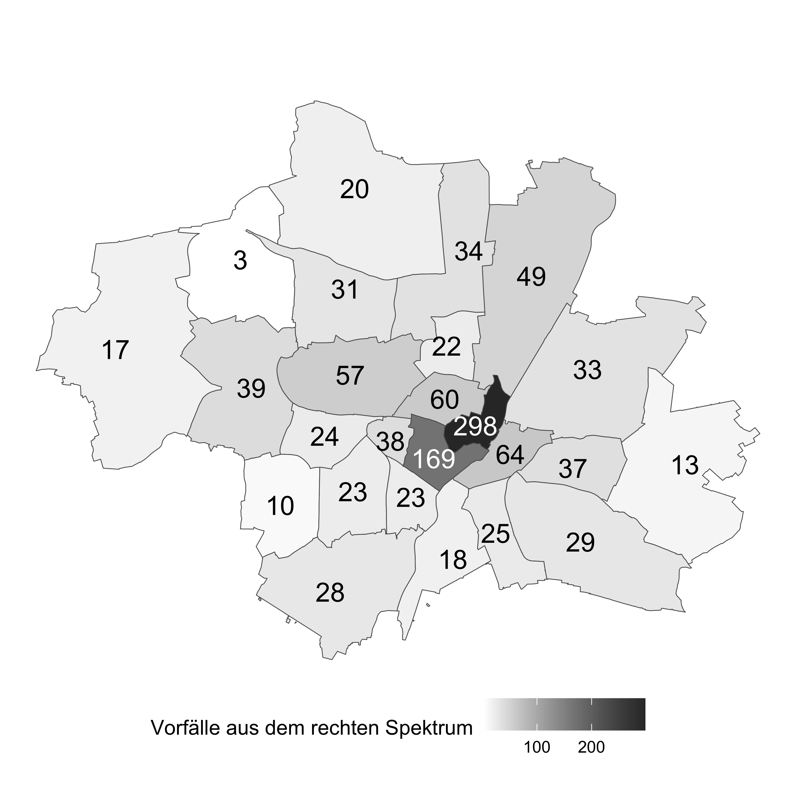
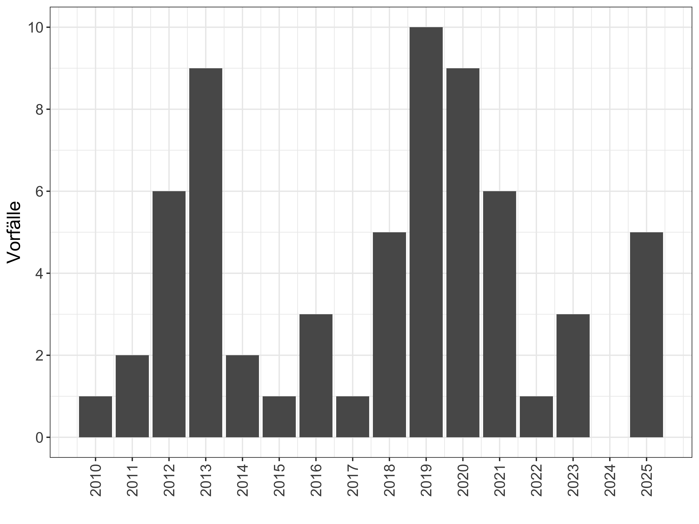
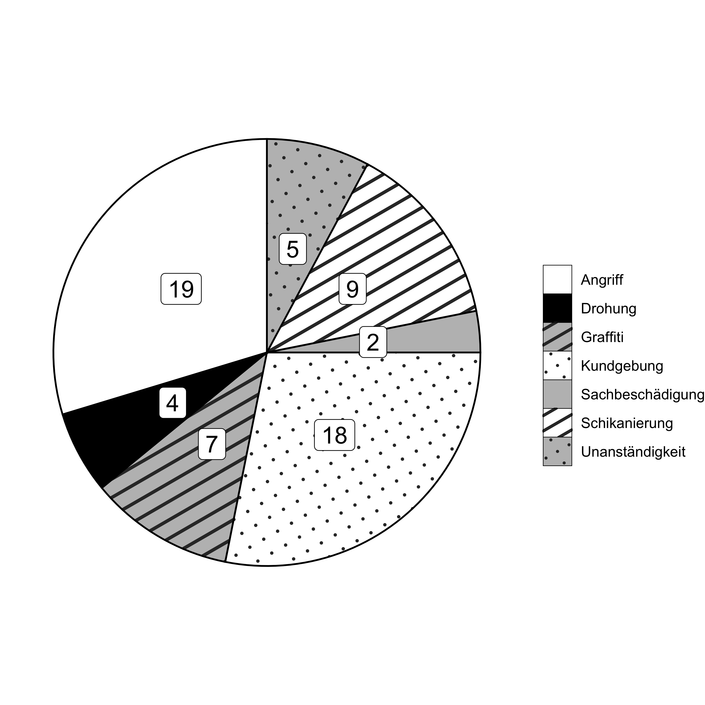

Die [Antifaschistische Informations- und Dokumentations- und Archivstelle Münchens e. V.](https://www.aida-archiv.de/) sammelt seit 1990 Material und veröffentlicht seit 1997 Vorfälle und Informationen über rechte Aktivitäten in Deutschland, insbesondere in Bayern. Die kleine Datenbank, die aus dem Projekt der Erstellung einer Chronologie entstand, ist online kostenlos zugänglich und wird Ehrenamtlichen gepflegt. Jeder Vorfall wird detailliert beschrieben und ist mit genauen Ortungsdaten versehen. Dadurch ist es möglich, die Vorfälle örtlich auf wenige Meter genau zu bestimmen. Vorfälle aus dem rechten Spektrum beinhalten sowohl Angriffe seitens der extremen Rechte, die unsere Demokratie nicht anerkennen und diese abschaffen wollen (z.B. Reichsbürger\*innen), als auch der radikalen Rechten, die, die Demokratie nicht abschaffen will jedoch gegen liberale Werte ist und kämpft (die AfD). 

In unserem Stadtteil Au-Haidhausen kam es in den Jahren von 2010 bis 2025 zu 64 gemeldeten Vorfällen aus dem rechten Spektrum. Nur in den Stadtteilen Ludwigsvorstadt-Isarvorstadt mit 169 und Altstadt-Lehel mit 298, gab es in den Jahren von 2010 bis Ende 2025 noch mehr Vorfälle aus dem rechten Spektrum. 

Die meisten Vorfälle (12, entspricht 18,75 Prozent innerhalb Haidhausens) ereigneten sich am und um den Ostbahnhof. Positiv zu erwähnen ist, dass Passant\*innen in einigen Fällen eingriffen. Allerdings sind in der Datenbank nur Vorfälle zu finden, die entweder von Betroffenen oder Zeug\*innen der Polizei gemeldet wurden. Die Dunkelziffer wird höher sein. Die Vorfälle, die uns vorliegen, sind nur jene, di gemeldet wurden. Orleans- und Weißenburger Platz werden immer wieder von rechten Gruppierungen für Infostände und Kundgebungen genutzt. Schmierereien werden kontinuierlich über den ganzen Stadtbezirk verteilt gefunden so zum Beispiel am 30. August 2025:

> Unbekannte hinterlassen zu einem nicht näher bekannten Zeitpunkt vor dem 30. August 2025 an der Postwiese in Haidhausen mehrere extrem rechten Schmierereien. Mit grüner Graffiti-Sprühfarbe malen sie dabei unter anderem ein Hakenkreuz, zwei „White Power“-Symbol (ähnl. Keltenkreuze), die Zahl 88 (Chiffre für „Heil Hitler“), die Buchstaben „NS“ (für „Nationalsozialismus“) und „WP“ (für „White Power“) sowie das Wort „SKIN“ an eine Holzwand. Außerdem schreiben sie die rassistischen Abwertung „Bimbo“ mit einem Hakenkreuz auf eine Bank und ritzen ein Hakenkreuz und das Wort „AZOV“ (für die extrem rechte, ukrainische Brigade Азов) an eine Wand. 

Beim Durchsehen der einzelnen Vorfälle in den Jahren 2013, 2019 und 2020 sind die Gründe für den Anstieg der Vorfälle nicht zu erkennen. Auffallend ist jedoch, dass es in Au-Haidhausen bis auf das Jahr 2024 immer gemeldete Vorfälle gab und es dementsprechend offensichtlich ein Problem des Bezirks ist. 

Die Vorfälle innerhalb Au-Haidhausens können in sieben Kategorien unterteilt werden. Deutlich wird, dass mit 29,7 Prozent di Kategorie „Angriffe“ die meisten Vorfälle aufweist. 

Unter anderem kam es 2019 zu folgendem Angriff: 

> 4. Februar 2019 München. Ein 30-Jähriger hält sich am Montagmorgen gegen 5.15 Uhr an der Trambahn-Haltestelle „Max-Weber-Platz“ auf. Dort wird der in München Wohnende zunächst von einer ihm unbekannten, männlichen Person angestarrt und kurz darauf unvermittelt mit der Faust gegen den Kopf geschlagen. Der Unbekannte beschimpft den gebürtigen Bosnier rassistisch („Scheißtürke“) und homophob („Schwuchtel“) und bespuckt den 30-Jährigen nach dem Angriff noch. Nachdem der Täter seinen zuvor ablegten Rucksack wieder aufgenommen hat, entfernt er sich in unbekannte Richtung. Die Polizei beschreibt ihn mit den folgenden Attributen: „männlich, ca. 25 Jahre, etwa 175cm groß, schlank, hochdeutsche Sprache“. Quellen Pressebericht des Polizeipräsidiums München vom 10. Februar 2019 und Artikel der „Abendzeitung“ (Printausgabe) vom 11. Februar 2019.

Die meisten, die in Haidhausen wohnen, haben vermutlich selbst schon Kundgebungen aus dem rechten Spektrum miterlebt. In den letzten Jahren konnte man beispielweise immer wieder einen kleinen Autokorso von Covid-Leugner\*innen durch Haidhausen fahren sehen. Mit 28,1 Prozent kommen Kundgebungen nach Angriffen in Au-Haidhausen am zweihäufigsten vor. 

Im Jahr 2013 kam es unter anderem zu folgender Kundgebung auf dem Weißenburger Platz: 22. Juni 2013 München. Die rechtspopulistische Gruppierung „Die Freiheit“ (DF) veranstaltet eine weitere ihrer zur Zeit mehrmals in der Woche stattfindenden Kundgebungen, diesmal am Weißenburger Platz. […]

Leider gibt es in den letzten Jahren einen Anstieg an Vorfällen aus dem rechten Milieu. „Im Jahr 2024 haben laut Bayerischem Innenministerium rassistische und antisemitische Straftaten in Bayern wieder zugenommen“ Positiv zu erwähnen bleibt, dass in einigen der Fällen, Zeug\*innen Zivilcourage bewiesen haben und eingeschritten sind.

Was können wir als Haidhauser\*innen für uns und unseren Stadtteil tun, damit sich alle Menschen hier wohlfühlen? Aufmerksam sein, hinschauen, eingreifen, melden, den Betroffenen zeigen, dass man selbst anderer Meinung ist. Zivilcourage muss wie ein Muskel trainiert werden. Je öfter man sich traut einzuschreiten, desto einfacher wird es. Denn sind wir mal ehrlich, die meisten von uns haben bereits Situationen erlebt, in denen wir ein Unwohlsein gespürt haben und eine Sekunde zu lange gezögert haben, anstatt einzugreifen. In diesen Momenten müssen wir unseren Muskel trainieren und dürfen nicht zögern. Wenn wir eine Gesellschaft wollen, in der alle Menschen Platz haben sollen, müssen wir uns dafür einsetzen, dass es für die Personen, die ausgrenzen, gewalttätig sind und gegen anderen hetzen so ungemütlich wie möglich ist. Nazis wird es leider immer geben, aber jede\*r Einzelne von uns kann dafür Sorge tragen, dass in unserer Gesellschaft solch ein Verhalten unerwünscht und schandhaft ist. 

Vorfälle können bei der Beratungsstelle für Betroffene von rechter und gruppenbezogen menschenfeindlicher Gewalt und Diskriminierung in München gemeldet werden: <https://www.before-muenchen.de/vorfaelle-melden/> bzw. Telefon: 089 46224670

******

Ursprünglich veröffentlicht von den Haidhauser Nachrichten: <a href="https://haidhauser-nachrichten.com/Archiv/2026/2026_04.pdf">https://haidhauser-nachrichten.com/Archiv/2026/2026_04.pdf</a>

