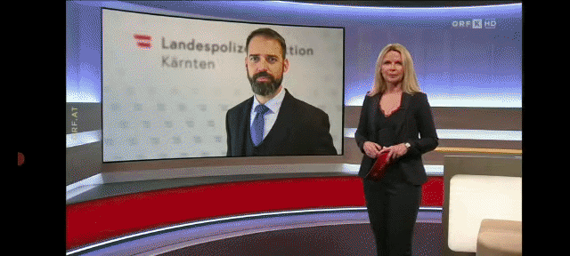
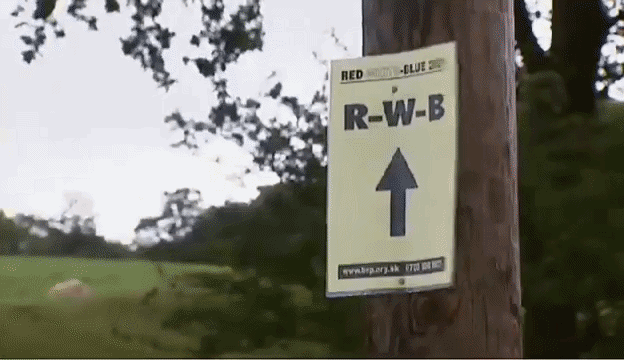
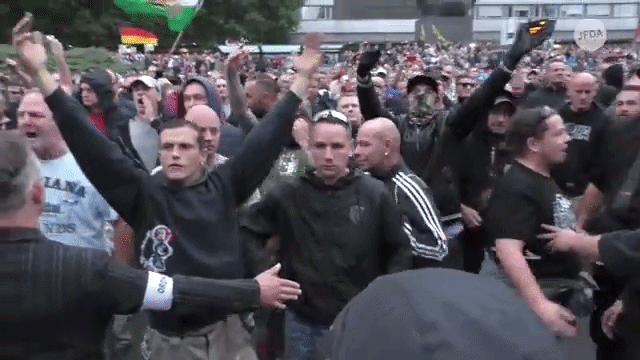
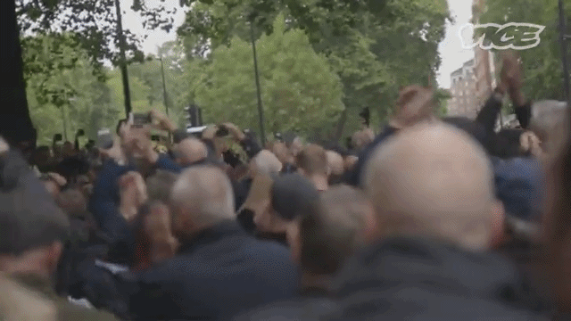
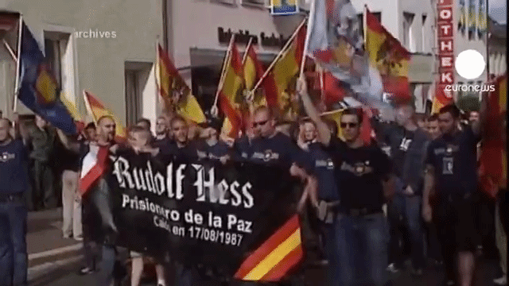
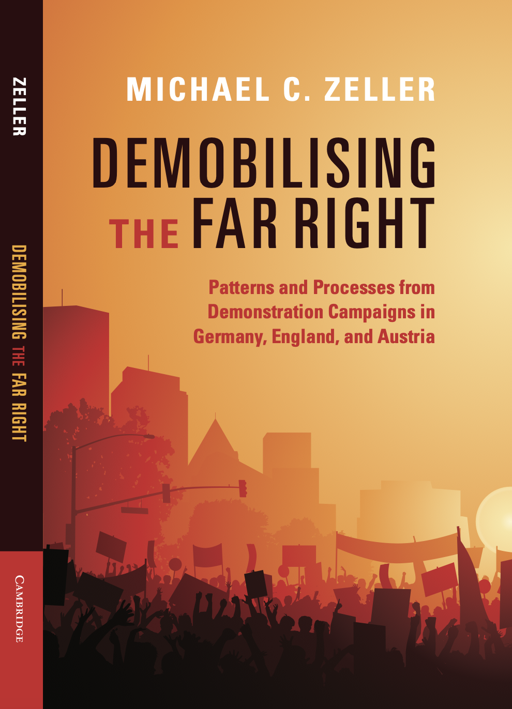

---

<!-- https://github.com/beatrizmilz/quarto-rladies-theme/tree/main -->
<!-- https://beatrizmilz.github.io/quarto-rladies-theme/#/gtgt -->
<!-- https://github.com/beatrizmilz/quarto-rladies-theme/blob/main/template.qmd -->

<!-- OUTLINE (* means only for academic) -->

<!-- - video montage of demos (DVU, uberg, BNP, also demos against generation Deutschland, Hess and/or other neo-Nazi demo) -->
<!-- - single slide with large RQ -->
<!-- - book cover  -->
<!-- - research design overview -->
<!--     + *subset of cases -->
<!--     + *fsQCA and process tracing -->
<!-- - data  -->
<!--     + active campaigns graphic? -->
<!--     + timelines graphic -->
<!--     + cases overview table (from appendix, Tab A.3.) -->
<!--     + thematic focus donuts  -->
<!--     + going from PED to campaigns dataset -->
<!-- - QCA  -->
<!--     + conditions and calibration  -->
<!--     + *no necessary disjuntions  -->
<!--     + abbreviated TT -->
<!--     + QCA solution  -->
<!--         * *with measures -->
<!--     + solution plot -->
<!--     + *robustness -->
<!--     + patterns of demob fig -->
<!-- - Case studies  -->
<!--     + *euler diagram and case selection  -->
<!-- - RWB  -->
<!--     + context (2 figures of election results) -->
<!--     + conditions of case  -->
<!--     + presumed and alternative mechanisms  -->
<!--     + mechanism graphic -->
<!-- - Uberg -->
<!--     + context (pictures of the site and plaques) -->
<!--     + conditions of case  -->
<!--     + presumed and alternative mechanisms  -->
<!--     + mechanism graphic -->
<!-- - DVU  -->
<!--     + context (pictures of Frey, Nibelungenhalle) -->
<!--     + conditions of case  -->
<!--     + presumed and alternative mechanisms  -->
<!--     + mechanism graphic and newspapers and debt/deficit figures -->
<!-- - Conclusions  -->
<!--     + DRAW HERE FROM CONCLUSIONS, BUT ALSO FROM TUTZING TALK, NOTES TO MAIK AND MICHAEL V.  -->

<!-- OUTLINE (wider public) -->

::: {.r-stack}

{.fragment .absolute top=50 left=10 width=800}

{.fragment .absolute top=10 right=10}

{.fragment .absolute bottom=50 left=5}

{.fragment .absolute bottom=30 right=5}

{.fragment .absolute top=30 left=5 width=800}

{.fragment .absolute top=10 right=30}

{.fragment .absolute bottom=10 left=30}

:::

# Alt gifs version {visibility="hidden"}

::: {.r-stack}

::: {.fragment .absolute top=50 left=10}
{width=800} 

Ulrichsberg Celebration
:::

::: {.fragment .absolute top=10 right=10}


BNP Red, White, and Blue Festival
:::

::: {.fragment .absolute bottom=50 left=5}


BNP Red, White, and Blue Festival
:::

::: {.fragment .absolute bottom=30 right=5}


Chemnitz 2018
:::

::: {.fragment .absolute top=30 left=5}
{width=800}

DVU Congress
:::

::: {.fragment .absolute top=10 right=30}


[Football Lads Alliance]{style="color:white;"}
:::

::: {.fragment .absolute bottom=10 left=30}


Hess Memorial March
::: 

:::


# Vids {visibility="hidden"}

::: {.r-stack}

::: {.fragment .absolute top=50 left=10}
<video id="uberg" src="cup_book_clips/uberg_Tauschitz_resignation_2022_all_parties.mp4" title='Ulrichsberg (AT)'
       width="900" controls controlslist="nodownload"></video>
:::

::: {.fragment .absolute top=10 right=10}
<video id="bnp2001" src="cup_book_clips/bnp-rwb_panorama_2001_rm_sound.mp4"
       title='BNP Red, White, and Blue Festival (UK) 2001'
       width="900" controls controlslist="nodownload"></video>
:::

::: {.fragment .absolute top=70 left=5}
<video id="bnp2008" src="cup_book_clips/bnp-rwb_2008_speech.mp4"
       title='BNP Red, White, and Blue Festival (UK) 2008'
       width="900" controls controlslist="nodownload"></video>
:::

::: {.fragment .absolute top=90 right=5}
<video id="chemnitz2018" src="cup_book_clips/chemnitz_2018-08-27_threats.mp4"
       title='Chemnitz (DE) 2018'
       width="900" controls controlslist="nodownload"></video>
:::

::: {.fragment .absolute top=50 left=10}
<video id="dvu1994" src="cup_book_clips/dvu_congress_1994-09-24_foreign_troops.mp4"
       title='DVU Passau (DE) 1994'
       width="900" controls controlslist="nodownload"></video>
:::

::: {.fragment .absolute bottom=10 right=10}
<video id="fla2020" src="cup_book_clips/fla_2020_do_this_peacefully.mp4"
       title='Football Lads Alliance (UK) 2019'
       width="900" controls controlslist="nodownload"></video>
:::

:::


<!-- poster="slide_files/03/spotlight_cover.png" -->

## {background-color="darkred"} 
<!-- #dc2223 -->

::: {style="text-align: center; color:yellow; font-size:80px; margin-top: 220px;"}
**Why do far-right movement campaigns demobilise?** 
:::


# {background-color="#fabf68" auto-animate=true}

 {.absolute top=200 left=200}

# {background-color="#fabf68" auto-animate=true}

:::: {.columns}
:::{.column width="50%"}
{width="400"}

:::

::: {.column width="50%"}
- Published by [Cambridge University Press](https://doi.org/10.1017/9781009720748)
- Available as hardback, paperback, and e-book 
- for order at [cambridge.org/9781009720762](https://www.cambridge.org/9781009720762)
    + enter code **[ZELLER26]{style="color:#dc2223;"}** at checkout for 20% discount (expires *2027-05-31*)
 
:::
::::

# Demobilisation

::: {.fragment .fade-up}
*the process whereby collective action, whether in the form of campaigns, organisations, or even whole movements, decreases and ultimately ends*
:::
 
. . . 

- covers *[decline]{style="color:#dc2223;"}* and *[cessation]{style="color:#dc2223;"}*
- applicable to campaigns, organisations, even whole movements 
    + campaigns: *[a series of strategically linked actions by an organising actor(s) in order to advance goals]{style="color:darkred;"}* <!-- [@Staggenborg2009] -->

. . . 

- difference of 'positive' demobilisation and 'negative' demobilisation (and non-demobilisation)
    <!-- + negative cases deserve attention: of ‘positive demobilisation’ (e.g., 1. anti-Wehrmachtsausstellung) or continued mobilisation (e.g., PEGIDA) — but many FR campaigns are intended to endure -->


## Demobilisation research 

::: {.fragment .fade-up style="margin-top: -20px;"}
- Macro-sociological approaches to movements <!-- including ‘contention’[Tilly1978])   -->
    + Tendency to gloss over demobilisation, formulate it as inverse of mobilisation    
        <!-- * *Mobilisation: the extent of resources under the collective control of the contender; as a process, an increase in the resources or in the degree of collective control (we can call a decline in either one demobilisation)* [@Tilly1978] -->

::: 

::: {.fragment .fade-up style="margin-top: -20px;"}
- Terrorism studies <!-- [@Cronin2009]    -->
    + theorisation often particular to militarised antagonism against the state   

::: 

::: {.fragment .fade-up style="margin-top: -20px;"}
- Repression research   
    + one grouping of (external) demobilising pressures inconsistent findings: by turns deterring<!-- [Tarrow2011] --> and inciting<!-- [Gurr1970]   -->
        * suggestive of causal complexity!  

::: 

## Demobilisation research 

::: {.fragment .fade-up}
- Social movement studies
    + demobilisation of social movement industries <!-- [Lasnier2017]  -->
    + biographical outcomes <!-- [McAdam1999] -->
    + psycho-social aspects of (non-)participation <!-- [Klandermans1997]  --> and activist 'burnout' <!-- [Nepstad2004] , [Gorski2015] -->
    + single-case studies on particular aspects of demobilisation <!-- [Demirel-Pegg2015, Demirel-Pegg2017] -->

::: 

::: {.fragment .fade-up} 
- Davenport [-@Davenport2015] provides most comprehensive theorisation of organisational demobilisation
    + some issues resulting from reliance on single-case inference 

::: 

## (Re-)Theorising demobilisation [@Davenport2015; @Earl2003]

::: {style="margin-top: -30px;"}

```{r}
library(kableExtra)
library(tidyverse)

## https://haozhu233.github.io/kableExtra/awesome_table_in_html.html

table_data <- data.frame(
  LP = c("*Burnout/exhaustion* (inability to continue participation)", 
                 "*Lost commitment* (unwillingness to continue participation)", 
                 "", 
                 ""),
  OF = c("*Membership loss* (failure to recruit/retain members)", 
                 "*Factionalisation* (internal splitting of organisations or coalitions)", 
                 "*Rigidity* (failure to adapt according to new circumstances)", 
                 ""),
  SC1 = c("(1) *Identity of", 
          "State agents (actors representing state institutions)", 
           "(2) *Character of", 
           "Coercion (direct repression; the threat or use of force)"),
  SC2 = c("repressive agent*",
          "Private agents (actors not representing state institutions)", 
          "repressive action*", 
          "Channelling (indirect repression, such as resource deprivation, problem depletion)")
)

table_data <- data.frame(
  LP = c("Burnout/exhaustion", 
         "(inability to continue participation)",
         "Lost commitment", 
         "(unwillingness to continue participation)", 
         "",
         ""),
  OF = c("Membership loss", 
         "(failure to recruit/retain members)",
         "Factionalisation",
         "(internal splitting of organisations or coalitions)", 
         "Rigidity", 
         "(failure to adapt according to new circumstances)"),
  SC1 = c("(1) Identity of", 
          "State agents (actors representing state institutions)", 
           "(2) Character of", 
           "Coercion (direct repression; the threat or use of force)",
          "",
         ""),
  SC2 = c("repressive agent",
          "Private agents (actors not representing state institutions)", 
          "repressive action", 
          "Channelling (indirect repression, such as resource deprivation, problem depletion)",
          "",
          "")
)

p <- kable(table_data, col.names = c("Lost Participation (individual level)", "Organisational Failure (group level)", "Social control", "(two dimensions)"), 
      align = c("l", "l", "r", "l")) %>%
  add_header_above(header = c("Internal" = 2, "External" = 2)) %>% 
  kable_minimal() %>%
  kable_styling(bootstrap_options = "striped", font_size = 24) %>% 
  # kable_classic_2(full_width = F) %>% 
  # column_spec(1:ncol(table_data), hline_after=F) %>% 
  column_spec(1, border_right=T) %>% 
  column_spec(2, border_right=T) %>% 
  row_spec(0, bold = T, background = "grey80", hline_after = F) %>% 
  row_spec(1, italic = T, color="darkred") %>% 
  row_spec(3, italic = T, color="darkred") %>% 
  row_spec(5, italic = T, color="darkred")
p

```

::: 

::: {.fragment .absolute .fade-up bottom=50 left=530 style="color:blue;"}
causal characteristics: conjuctural, equifinal, asymmetric, multifinal

::: 


<!-- ::: {style="margin-top: -30px;"} -->
<!-- - adapting from @Davenport2015 and @Earl2003  -->

<!-- :::  -->


## Why this research?
<!-- far-right campaign demobilisation? -->

::: {.fragment .fade-up style="margin-top: -35px;"} 
- Why demobilisation?
    + mobilisation and activism most studied aspects of social movements---relatively little about demobilisation

::: 

::: {.fragment .fade-up style="margin-top: -35px;"} 
- Why campaigns?
    + again, less studied compared to macro-level ‘cycles of contention’ <!-- [@Tarrow2011] --> and to studies of particular organisation's campaigns: *how movements move*---yet a unit of analysis infrequently examined in SMS

::: 

::: {.fragment .fade-up style="margin-top: -35px;"} 
- Why the far right?
    + demonstration campaigns are particularly important for far-right movements, many benefits---still, even with online activity
    + pressing subset of cases, but also generalizable to others

::: 

# Research 

- *subset of cases
    + Campaigns consist of four essential elements[Staggenborg2009]: (1) constant organising actor(s), (2) temporal boundedness, (3) strategically linked actions, (4) intention to advance movement goals 
    + Demonstrations---ubiquitous movement tactic. Particularly important for far right, both **symbolically** and **instrumentally**
        * extreme right[Mudde1995] traits: nationalism, racism, xenophobia, anti- democracy, and prefer strong state
        * radical right[Mudde2007ch1] traits: nativism, authoritarianism, and populism
        * importance of demonstrations endures for far right, enhanced by online spaces
    + here, 'large' is a campaign that mobilised at least 1000 participants
- *fsQCA and process tracing

# Data 

- data ("Zbook.fr_demos_dataset.xlsx", sheet = "Campaigns"; "Zbook.fr_demos_dataset_zeller.xlsx" for all the rest) -- ALL NOW IN "Zeller_CUP2026_data.xlsx" -- **offer as download on webpage**
    + active campaigns graphic?
    + timelines graphic
    + cases overview table (from appendix, Tab A.3.)
    + thematic focus donuts
    + going from PED to campaigns dataset

## Why cases in Germany, Austria, & England? 

- Guarding against limited diversity
    + Germany: high mobilisation (and weak parties, at least until 2017), but also most active state social control against far right
    + Austria: regular mobilisation, but mostly around fraternity and Wehrmacht events---often tolerated or even endorsed by the state 
    + England: sporadic mobilisation---mostly ignored or contained
- Beneficial for finding more generalisable results (i.e., patterns not limited to one country)

## Active campaigns

```{r campaign-timing}
## fig.cap="Demonstration campaigns active during the period of study.", fig.scap="Demonstration campaigns active during the period of study", fig.alt="The bar chart shows active far-right demonstration campaigns across Germany, England, and Austria from 1990 to 2020. The X-axis represents the years, from 1990 to 2020. The Y-axis shows the number of active campaigns, ranging from 0 to 16. Each bar in the graph corresponds to a specific year, with bars stacked and coloured by country: Germany is in dark grey, England in white, and Austria in medium grey. Germany shows the highest frequency of campaigns, with peaks especially in 2015-2016. England and Austria have comparatively fewer campaigns, with fluctuations over the years. Austria and England never exceeded four active campaigns."
library(ggplot2)

year <- c(rep(c(1990,1991,1992,1993,1994,1995,1996,1997,1998,1999,2000,2001,2002,2003,2004,2005,2006,2007,2008,2009,2010,2011,2012,2013,2014,2015,2016,2017,2018,2019,2020), each = 3))
country <- c(rep(c("Germany", "England", "Austria"), times = 31))
active <- c(4,0,2,#1990:1Hess,1Waffen,DVU,Mittenwald - Uberg,WKR
            4,0,2,#1991:1Hess,1Waffen,DVU,Mittenwald - Uberg,WKR
            4,0,2,#1992:1Hess,1Waffen,DVU,Mittenwald - Uberg,WKR
            3,0,2,#1993:1Hess,DVU,Mittenwald - Uberg,WKR
            3,0,2,#1994:1Hess,DVU,Mittenwald - Uberg,WKR
            2,0,2,#1995:DVU,Mittenwald - Uberg,WKR
            2,0,2,#1996:DVU,Mittenwald - Uberg,WKR
            3,0,2,#1997:1Wehrmacht,DVU,Mittenwald - Uberg,WKR
            3,0,2,#1998:1Wehrmacht,DVU,Mittenwald - Uberg,WKR
            3,1,2,#1999:1Wehrmacht,DVU,Mittenwald - BNP - Uberg,WKR
            3,1,2,#2000:1Dresden,DVU,Mittenwald - BNP - Uberg,WKR
            6,1,2,#2001:1Dresden,2Hess,2Wehrmacht,DVU,Mittenwald,Pressefest, - BNP - Uberg,WKR
            6,1,2,#2002:1Dresden,2Hess,2Waffen,2Wehrmacht,Mittenwald,Pressefest, - BNP - Uberg,WKR
            6,1,2,#2003:1Dresden,2Hess,2Waffen,2Wehrmacht,Mittenwald,Pressefest, - BNP - Uberg,WKR
            6,1,2,#2004:1Dresden,2Hess,2Waffen,2Wehrmacht,Mittenwald,Pressefest, - BNP - Uberg,WKR
            7,1,2,#2005:1Dresden,2Waffen,Antikrieg,FdV,Magdeburg,Mittenwald,Pressefest, - BNP - Uberg,WKR
            8,1,2,#2006:1Dresden,2Waffen,Antikrieg,FdV,Magdeburg,Mittenwald,Nenndorf,Pressefest - BNP - Uberg,WKR
            9,1,2,#2007:1Dresden,2Waffen,Antikrieg,FdV,Magdeburg,Mittenwald,Nenndorf,Pressefest,Sachsentag - BNP - Uberg,WKR
            8,1,2,#2008:1Dresden,Antikrieg,FdV,Magdeburg,Mittenwald,Nenndorf,Pressefest,Sachsentag - BNP - Uberg,WKR
            9,2,2,#2009:1Dresden,Antikrieg,FdV,Magdeburg,Mittenwald,Nenndorf,Pressefest,Sachsentag,TddZ - BNP,EDL - Uberg,WKR
            9,1,2,#2010:1Dresden,Antikrieg,FdV,Magdeburg,Mittenwald,Nenndorf,Pressefest,Sachsentag,TddZ - EDL - Uberg,WKR
            9,1,2,#2011:1Dresden,Antikrieg,Eichsfeld,Magdeburg,Mittenwald,Nenndorf,Pressefest,Sachsentag,TddZ - EDL - Uberg,WKR
            9,1,2,#2012:1Dresden,Antikrieg,Eichsfeld,Magdeburg,Mittenwald,Nenndorf,Pressefest,Sachsentag,TddZ - EDL - Uberg,WKR
            9,2,2,#2013:1Dresden,Antikrieg,Eichsfeld,Magdeburg,Mittenwald,Nenndorf,Schneeberg,Sachsentag,TddZ - EDL,Rigby - Akadem,Uberg
            8,1,2,#2014:Eichsfeld,HoGeSa,Magdeburg,Mittenwald,Nenndorf,PEGIDA,Schneeberg,TddZ - EDL - Akadem,Uberg
            14,0,2,#2015:2Dresden,Eichsfeld,Einsiedel,Freigeist,Freital,Heidenau,HoGeSa,Legida,Magdeburg,Mittenwald,Nenndorf,PEGIDA,S/TH-ÜGIDA,TddZ -  - Akadem,Uberg
            10,0,2,#2016:2Dresden,Eichsfeld,Einsiedel,Legida,Magdeburg,Merkel,Mittenwald,PEGIDA,S/TH-ÜGIDA,TddZ -  - Akadem,Uberg
            8,1,2,#2017:2Dresden,Eichsfeld,Magdeburg,Merkel,Mittenwald,PEGIDA,S/TH-ÜGIDA,TddZ - FLA - Akadem,Uberg
            8,4,1,#2018:2Dresden,AfD,Chemnitz,Eichsfeld,Magdeburg,Mittenwald,PEGIDA,TddZ - FLA,DFLA,Justice,Tommy - Akadem
            6,2,1,#2019:2Dresden,Eichsfeld,Magdeburg,Mittenwald,PEGIDA,TddZ - Justice,Tommy - Akadem
            5,0,1 #2020:2Dresden,Magdeburg,Mittenwald,PEGIDA,TddZ - Akadem
            )

timing <- data.frame(year, country, active)

colourversion <- ggplot(timing, aes(x=year, y=active, fill=country)) +
  geom_bar(stat = "identity") +
  theme_bw() + 
  scale_x_continuous("",breaks=seq(1990,2020,1),minor_breaks=seq(1990,2020,1))+
  scale_y_continuous("Active large far-right demonstration campaigns", 
                     breaks=seq(0,16,1), minor_breaks=seq(0,16,1)) + 
  theme(axis.text.x = element_text(angle = 90, vjust = 0.5, hjust=1, size=11),
        axis.text.y = element_text(size=11),
        legend.title=element_blank(),
        legend.position="bottom")
# colourversion

bwversion <- ggplot(timing, aes(x=year, y=active, alpha=country)) +
  geom_bar(stat = "identity") +
  theme_bw() + 
  scale_x_continuous("",breaks=seq(1990,2020,1),minor_breaks=seq(1990,2020,1)) +
  scale_y_continuous("Active large far-right demonstration campaigns",
                     breaks=seq(0,16,1), minor_breaks=seq(0,16,1)) + 
  theme(axis.text.x = element_text(angle = 90, vjust = 0.5, hjust=1, size=11),
        axis.text.y = element_text(size=11),
        legend.title=element_blank(),
        legend.position="bottom") +
  scale_alpha_ordinal(range = c(0.3, 1))
# bwversion

better_bwversion <- ggplot(timing, aes(x=year, y=active, fill=country)) +
  geom_bar(stat = "identity", colour="black") +
  theme_bw() + 
  scale_x_continuous("",breaks=seq(1990,2020,1),minor_breaks=seq(1990,2020,1))+
  scale_y_continuous("Active large far-right demonstration campaigns", 
                     breaks=seq(0,16,1), minor_breaks=seq(0,16,1)) + 
  scale_fill_manual(values=c("grey30", "white" ,"grey60")) +
  theme(axis.text.x = element_text(angle = 90, vjust = 0.5, hjust=1, size=11),
        axis.text.y = element_text(size=11),
        legend.title=element_blank(),
        legend.position="bottom")
# better_bwversion

better_cversion <- ggplot(timing, aes(x=year, y=active, fill=country)) +
  geom_bar(stat = "identity", colour="black") +
  theme_bw() + 
  scale_x_continuous("",breaks=seq(1990,2020,1),minor_breaks=seq(1990,2020,1))+
  scale_y_continuous("Active far-right campaigns", 
                     breaks=seq(0,16,1), minor_breaks=seq(0,16,1)) + 
  scale_fill_manual(values=c("firebrick1" ,"navy", "goldenrod")) +
  theme(axis.text.x = element_text(angle = 90, vjust = 0.5, hjust=1, size=14),
        axis.text.y = element_text(size=14),
        axis.title.y = element_text(size = 18),
        legend.title=element_blank(),
        legend.text=element_text(size=14),
        legend.position="bottom")
better_cversion
  
```


## Timelines graphic

```{r all-demo-campaigns, echo=FALSE}
library(reshape2)
library(dplyr)
library(ggplot2) 
## , fig.cap="Demonstration campaign timelines organised in descending order of size (‘*’ denotes campaign initiation before the period of interest; ‘**’ denotes campaign continuation through today).", fig.scap="Demonstration campaign timelines", fig.alt="This is a timeline of far-right demonstration campaigns that occurred between 1990 and 2020 in Germany, Austria, and England. The horizontal axis represents time. It spans from the beginning of 1990 to the end of 2020. The dates are broken down into yearly increments, with each year labeled along the axis. The time spans for each campaign is marked as lines that stretch across the X-axis according to their start and end dates. The vertical axis lists the campaign names. These campaign names are ordered in a list along the Y-axis from largest average demonstration size to smallest average demonstration size. Each row shows a specific campaign and the position of the event along the X-axis is determined by the campaign's start and end dates. The campaigns' lines are colour-coded based on the country where the event took place: light grey is used for campaigns that took place in Austria; medium grey represents campaigns in Germany; black is used for campaigns that occurred in England.", out.extra='angle=90', out.width='135%'


# ‘***’ denotes campaign initiation before and continuation after the period of interest

## This graphic is a timeline visualisation of far-right demonstration campaigns that occurred between 1990 and 2020 in Germany, Austria, and England. The horizontal axis represents time. It spans from the beginning of 1990 to the end of 2020. The dates are broken down into yearly increments, with each year labeled along the axis. The time spans for each far-right demonstration campaign is marked as lines that stretch across the X-axis according to their start and end dates. The vertical axis lists the far-right demonstration campaign names (such as PEGIDA Dresden, Dresden Memorial March, Vienna Korporations Ball, etc.). These event names are ordered in a list along the Y-axis from largest average demonstration size (i.e., FLA Against Extremism) to smallest average demonstration size (i.e., S/TH-ÜGIDA). Each row represents a specific event, and the position of the event along the X-axis is determined by the event's start and end dates. The far-right demonstration campaigns' lines are colour-coded based on the country where the event took place: light grey is used for far-right demonstration campaigns that took place in Austria; medium grey represents far-right demonstration campaigns in Germany; black is used for far-right demonstration campaigns that occurred in England.

a <-c("Linz Fraternity Ball",           "1990-01-01","2020-01-01","Austria")
b <-c("S/TH-ÜGIDA",                        "2015-01-12","2017-08-17","Germany")
c <-c("Stop the Migration Pact",           "2018-10-20","2018-12-12","Germany")
d <-c("Heidenau Listens",                  "2015-08-19","2015-11-07","Germany")
e <-c("Eichsfeld Homeland Day",             "2011-09-03","2019-05-18","Germany")
f <-c("Bad Nenndorf Memorial March",       "2006-07-29","2015-08-01","Germany")
g <-c("Justice for Women and Children",    "2018-06-30","2019-06-22","England")
h <-c("DFLA Campaign",                     "2018-01-31","2018-10-13","England")
i <-c("AN Anti-War Day",                   "2005-09-03","2013-09-07","Germany")
j <-c("1. Waffen-SS Commemoration",        "1990-11-16","1992-11-15","Germany")
k <-c("SaxonyDay",                         "2007-08-04","2013-06-08","Germany")
l <-c("Day of German Future",              "2009-06-06","2020-01-01","Germany")
m <-c("Freital Stands Up",                 "2015-03-06","2015-06-19","Germany")
n <-c("REP Ash Wednesday Rally",          "1990-01-01","2005-02-09","Germany")
o <-c("2. Dresden Memorial March",         "2015-02-10","2020-01-01","Germany")
p <-c("EDL Rally",                         "2009-04-13","2014-08-23","England")
q <-c("FreeSpirit",                        "2015-10-10","2015-11-21","Germany")
r <-c("Vienna Academic Ball",            "2013-02-01","2020-01-01","Austria")
s <-c("2. Waffen-SS Commemoration",        "2002-11-17","2007-03-03","Germany")
t <-c("Magdeburg Memorial March",          "2005-01-15","2015-01-16","Germany")
u <-c("Festival of the Peoples",           "2005-06-11","2010-09-01","Germany")
v <-c("Ulrichsberg Celebration",          "1990-01-01","2018-01-01","Austria")
w <-c("2. Anti-Wehrmacht Exhibition",      "2001-11-24","2004-03-27","Germany")
x <-c("Schneeberg Torch Run",              "2013-10-19","2014-11-29","Germany")
y <-c("Einsiedel Says No",                 "2015-09-23","2016-06-30","Germany")
z <-c("LEGIDA",                            "2015-01-12","2015-12-07","Germany")
aa<-c("For Germany - Merkel Must Go",      "2016-03-12","2017-09-09","Germany")
ab<-c("1. Anti-Wehrmacht Exhibition",      "1997-03-01","1999-07-10","Germany")
ac<-c("Mittenwald Mountain Infantry Pentecost","1990-01-01","2010-05-09","Germany")
ad<-c("Mourn Lee Rigby",                   "2013-05-25","2013-07-20","England")
ae<-c("BNP Red, White and Blue Festival",  "1999-07-01","2009-08-15","England")
af<-c("Dresden Memorial March",            "2000-02-13","2020-01-01","Germany")
ag<-c("1. Hess Memorial March",           "1990-01-01","1993-08-14","Germany") # "1988-08-18"
ah<-c("Vienna Korporations Ball",         "1990-01-01","2012-01-27","Austria")
ai<-c("HoGeSa",                            "2014-10-26","2015-10-25","Germany")
aj<-c("2018 Pro Chemnitz",                 "2018-08-27","2018-12-14","Germany")
ak<-c("2. Hess Memorial March",            "2001-08-19","2004-08-21","Germany")
al<-c("1. Dresden Memorial March",         "2000-02-13","2013-02-13","Germany")
am<-c("DVU Congress",                     "1990-01-01","2001-09-29","Germany") # "1987-08-15"
an<-c("March for Life",                    "2002-09-14","2020-01-01","Germany")
ao<-c("Press Festival of Deutsche Stimme", "2001-09-08","2012-08-11","Germany")
ap<-c("Free Tommy Robinson",               "2018-03-18","2019-08-03","England")
aq<-c("PEGIDA Dresden",                  "2014-11-03","2020-01-01","Germany")
ar<-c("FLA Against Extremism",             "2017-06-24","2018-05-19","England")

siz <- as.data.frame(rbind(a,b,c,d,e,f,g,h,i,j,k,l,m,n,o,p,q,r,s,t,u,v,w,x,y,z,aa,ab,ac,ad,ae,af,ag,ah,ai,aj,ak,al,am,an,ao,ap,aq,ar))

colnames(siz) <- c("name","start.date","end.date","Country")

siz$start.date <- as.Date(siz$start.date)
siz$end.date <- as.Date(siz$end.date)
siz$name = factor(siz$name, levels = siz$name)

siz <- siz[!(siz$name %in% "Linz Fraternity Ball"),]
siz <- siz[!(siz$name %in% "March for Life"),]
siz <- siz[!(siz$name %in% "Dresden Memorial March"),]
siz <- siz[!(siz$name %in% "REP Ash Wednesday Rally"),]
# rownames(siz) <- siz$name

msiz <- melt(siz, measure.vars = c("start.date", "end.date"))

# WITH COLOUR: 
camp_colour<-ggplot(msiz, aes(value, name, colour = Country)) + 
  geom_line(linewidth = 2) + 
  scale_x_date("",date_labels="%Y",date_breaks="2 year",minor_breaks="1 year",
               seq(from = as.Date("1990-01-01"), to = as.Date("2020-12-31"),
                 by = "year"),
               limits = c(as.Date("1990-01-01"), as.Date("2020-12-31")), expand=c(0.0,0.0))+
  # scale_x_date("",date_labels="%Y",date_breaks="5 year",minor_breaks="1 year", 
               # limits = c(min(msiz$value), max(msiz$value)) )+ #, expand=c(0.05,0.05))+
  # scale_y_discrete("", expand=c(0,0.05))+
  ylab(NULL) + # xlab(NULL) +
  theme_bw()+
  theme(axis.text.x = element_text(angle = 90, vjust = 0.5, hjust=1, size=11),
        #axis.text.y = element_text(size = 10),
        legend.text=element_text(size=12),
        legend.title=element_blank(),
        legend.position="bottom")
# camp_colour


# #Linzer Burschenbundball
#   annotate(geom = "segment",
#            x = as.Date(msiz$value[msiz$name=="Linzer Burschenbundball" & msiz$variable=="start.date"])-200, xend = as.Date(msiz$value[msiz$name=="Linzer Burschenbundball" & msiz$variable=="end.date"])+200,
#            y = which(msiz$name=="Linzer Burschenbundball" & msiz$variable=="start.date"), yend = which(msiz$name=="Linzer Burschenbundball" & msiz$variable=="start.date"),
#            arrow = arrow(length=unit(0.20,"cm"), ends="both", type = "closed"),
#            linewidth = 1, color = "grey75")+
# #REP Aschermittwochsveranstaltung
#   annotate(geom = "segment", 
#            x = as.Date(msiz$value[msiz$name=="REP Aschermittwochsveranstaltung" & msiz$variable=="start.date"])-200, xend = as.Date(msiz$value[msiz$name=="REP Aschermittwochsveranstaltung" & msiz$variable=="end.date"]), 
#            y = which(msiz$name=="REP Aschermittwochsveranstaltung" & msiz$variable=="start.date"), yend = which(msiz$name=="REP Aschermittwochsveranstaltung" & msiz$variable=="start.date"), 
#            arrow = arrow(length=unit(0.20,"cm"), ends="first", type = "closed"),
#            linewidth = 1, color = "black")


# library(lubridate)
# # GREY SCALE: 
camp_bw <- ggplot(msiz, aes(value, name, colour = Country))+geom_line(linewidth = 2)+
  scale_x_date("",date_labels="%Y",date_breaks="1 year",minor_breaks="1 year",
               seq(from = as.Date("1989-03-01"), to = as.Date("2020-12-31"),
                 by = "year"),
               limits = c(as.Date("1989-03-01"), as.Date("2020-12-311")), expand=c(0.0,0.0))+
  scale_color_manual(values=c("grey85", "grey50" ,"black")) +
  ylab(NULL) + theme_minimal() + scale_alpha_ordinal(range = c(0.3, 1)) +
  theme(axis.text = element_text(size=7),
        axis.text.x = element_text(angle = 90, vjust = 0.5, hjust=1),
        # axis.text.y = element_text(size = 8),
        legend.text=element_text(size=8),
        legend.title=element_blank(),
        legend.position="bottom")+
#PEGIDA Dresden
  annotate(geom = "segment", 
           x = as.Date(msiz$value[msiz$name=="PEGIDA Dresden" & msiz$variable=="start.date"]), xend = as.Date(msiz$value[msiz$name=="PEGIDA Dresden" & msiz$variable=="end.date"])+100, 
           y = which(msiz$name=="PEGIDA Dresden" & msiz$variable=="start.date"), yend = which(msiz$name=="PEGIDA Dresden" & msiz$variable=="start.date"), 
           arrow = arrow(length=unit(0.20,"cm"), ends="last", type = "closed"),
           linewidth = 1, color = "black")+
#2. Dresden Memorial March
  annotate(geom = "segment", 
           x = as.Date(msiz$value[msiz$name=="2. Dresden Memorial March" & msiz$variable=="start.date"]), xend = as.Date(msiz$value[msiz$name=="2. Dresden Memorial March" & msiz$variable=="end.date"])+100, 
           y = which(msiz$name=="2. Dresden Memorial March" & msiz$variable=="start.date"), yend = which(msiz$name=="2. Dresden Memorial March" & msiz$variable=="start.date"), 
           arrow = arrow(length=unit(0.20,"cm"), ends="last", type = "closed"),
           linewidth = 1, color = "black")+
#Vienna Korporations Ball
  annotate(geom = "segment", 
           x = as.Date(msiz$value[msiz$name=="Vienna Korporations Ball" & msiz$variable=="start.date"])-100, xend = as.Date(msiz$value[msiz$name=="Vienna Korporations Ball" & msiz$variable=="end.date"]), 
           y = which(msiz$name=="Vienna Korporations Ball" & msiz$variable=="start.date"), yend = which(msiz$name=="Vienna Korporations Ball" & msiz$variable=="start.date"), 
           arrow = arrow(length=unit(0.20,"cm"), ends="first", type = "closed"),
           linewidth = 1, color = "grey85")+
#Mittenwald Mountain Infantry Pentecost
  annotate(geom = "segment", 
           x = as.Date(msiz$value[msiz$name=="Mittenwald Mountain Infantry Pentecost" & msiz$variable=="start.date"])-100, xend = as.Date(msiz$value[msiz$name=="Mittenwald Mountain Infantry Pentecost" & msiz$variable=="end.date"]), 
           y = which(msiz$name=="Mittenwald Mountain Infantry Pentecost" & msiz$variable=="start.date"), yend = which(msiz$name=="Mittenwald Mountain Infantry Pentecost" & msiz$variable=="start.date"), 
           arrow = arrow(length=unit(0.20,"cm"), ends="first", type = "closed"),
           linewidth = 1, color = "black")+
#DVU Congress
  annotate(geom = "segment", 
           x = as.Date(msiz$value[msiz$name=="DVU Congress" & msiz$variable=="start.date"])-100, xend = as.Date(msiz$value[msiz$name=="DVU Congress" & msiz$variable=="end.date"]), 
           y = which(msiz$name=="DVU Congress" & msiz$variable=="start.date"), yend = which(msiz$name=="DVU Congress" & msiz$variable=="start.date"), 
           arrow = arrow(length=unit(0.20,"cm"), ends="first", type = "closed"),
           linewidth = 1, color = "black")+
#1. Hess Memorial March
  annotate(geom = "segment", 
           x = as.Date(msiz$value[msiz$name=="1. Hess Memorial March" & msiz$variable=="start.date"])-100, xend = as.Date(msiz$value[msiz$name=="1. Hess Memorial March" & msiz$variable=="end.date"]), 
           y = which(msiz$name=="1. Hess Memorial March" & msiz$variable=="start.date"), yend = which(msiz$name=="1. Hess Memorial March" & msiz$variable=="start.date"), 
           arrow = arrow(length=unit(0.20,"cm"), ends="first", type = "closed"),
           linewidth = 1, color = "black")+
#Ulrichsberg Celebration
  annotate(geom = "segment", 
           x = as.Date(msiz$value[msiz$name=="Ulrichsberg Celebration" & msiz$variable=="start.date"])-100, xend = as.Date(msiz$value[msiz$name=="Ulrichsberg Celebration" & msiz$variable=="end.date"]), 
           y = which(msiz$name=="Ulrichsberg Celebration" & msiz$variable=="start.date"), yend = which(msiz$name=="Ulrichsberg Celebration" & msiz$variable=="start.date"), 
           arrow = arrow(length=unit(0.20,"cm"), ends="first", type = "closed"),
           linewidth = 1, color = "grey85")+
#Vienna Academic Ball
  annotate(geom = "segment", 
           x = as.Date(msiz$value[msiz$name=="Vienna Academic Ball" & msiz$variable=="start.date"]), xend = as.Date(msiz$value[msiz$name=="Vienna Academic Ball" & msiz$variable=="end.date"])+100, 
           y = which(msiz$name=="Vienna Academic Ball" & msiz$variable=="start.date"), yend = which(msiz$name=="Vienna Academic Ball" & msiz$variable=="start.date"), 
           arrow = arrow(length=unit(0.20,"cm"), ends="last", type = "closed"),
           linewidth = 1, color = "grey85")
# camp_bw

camp_colour <- ggplot(msiz, aes(value, name, colour = Country))+geom_line(linewidth = 2)+
  scale_x_date("",date_labels="%Y",date_breaks="1 year",minor_breaks="1 year",
               seq(from = as.Date("1989-03-01"), to = as.Date("2020-12-31"),
                 by = "year"),
               limits = c(as.Date("1989-03-01"), as.Date("2020-12-311")), expand=c(0.0,0.0))+
  scale_color_manual(values=c("firebrick1", "navy" ,"goldenrod")) +
  ylab(NULL) + theme_minimal() + scale_alpha_ordinal(range = c(0.3, 1)) +
  theme(axis.text = element_text(size=7),
        axis.text.x = element_text(angle = 90, vjust = 0.5, hjust=1),
        # axis.text.y = element_text(size = 8),
        legend.text=element_text(size=8),
        legend.title=element_blank(),
        legend.position="bottom")+
#PEGIDA Dresden
  annotate(geom = "segment", 
           x = as.Date(msiz$value[msiz$name=="PEGIDA Dresden" & msiz$variable=="start.date"]), xend = as.Date(msiz$value[msiz$name=="PEGIDA Dresden" & msiz$variable=="end.date"])+100, 
           y = which(msiz$name=="PEGIDA Dresden" & msiz$variable=="start.date"), yend = which(msiz$name=="PEGIDA Dresden" & msiz$variable=="start.date"), 
           arrow = arrow(length=unit(0.20,"cm"), ends="last", type = "closed"),
           linewidth = 1, color = "goldenrod")+
#2. Dresden Memorial March
  annotate(geom = "segment", 
           x = as.Date(msiz$value[msiz$name=="2. Dresden Memorial March" & msiz$variable=="start.date"]), xend = as.Date(msiz$value[msiz$name=="2. Dresden Memorial March" & msiz$variable=="end.date"])+100, 
           y = which(msiz$name=="2. Dresden Memorial March" & msiz$variable=="start.date"), yend = which(msiz$name=="2. Dresden Memorial March" & msiz$variable=="start.date"), 
           arrow = arrow(length=unit(0.20,"cm"), ends="last", type = "closed"),
           linewidth = 1, color = "goldenrod")+
#Vienna Korporations Ball
  annotate(geom = "segment", 
           x = as.Date(msiz$value[msiz$name=="Vienna Korporations Ball" & msiz$variable=="start.date"])-100, xend = as.Date(msiz$value[msiz$name=="Vienna Korporations Ball" & msiz$variable=="end.date"]), 
           y = which(msiz$name=="Vienna Korporations Ball" & msiz$variable=="start.date"), yend = which(msiz$name=="Vienna Korporations Ball" & msiz$variable=="start.date"), 
           arrow = arrow(length=unit(0.20,"cm"), ends="first", type = "closed"),
           linewidth = 1, color = "firebrick1")+
#Mittenwald Mountain Infantry Pentecost
  annotate(geom = "segment", 
           x = as.Date(msiz$value[msiz$name=="Mittenwald Mountain Infantry Pentecost" & msiz$variable=="start.date"])-100, xend = as.Date(msiz$value[msiz$name=="Mittenwald Mountain Infantry Pentecost" & msiz$variable=="end.date"]), 
           y = which(msiz$name=="Mittenwald Mountain Infantry Pentecost" & msiz$variable=="start.date"), yend = which(msiz$name=="Mittenwald Mountain Infantry Pentecost" & msiz$variable=="start.date"), 
           arrow = arrow(length=unit(0.20,"cm"), ends="first", type = "closed"),
           linewidth = 1, color = "goldenrod")+
#DVU Congress
  annotate(geom = "segment", 
           x = as.Date(msiz$value[msiz$name=="DVU Congress" & msiz$variable=="start.date"])-100, xend = as.Date(msiz$value[msiz$name=="DVU Congress" & msiz$variable=="end.date"]), 
           y = which(msiz$name=="DVU Congress" & msiz$variable=="start.date"), yend = which(msiz$name=="DVU Congress" & msiz$variable=="start.date"), 
           arrow = arrow(length=unit(0.20,"cm"), ends="first", type = "closed"),
           linewidth = 1, color = "goldenrod")+
#1. Hess Memorial March
  annotate(geom = "segment", 
           x = as.Date(msiz$value[msiz$name=="1. Hess Memorial March" & msiz$variable=="start.date"])-100, xend = as.Date(msiz$value[msiz$name=="1. Hess Memorial March" & msiz$variable=="end.date"]), 
           y = which(msiz$name=="1. Hess Memorial March" & msiz$variable=="start.date"), yend = which(msiz$name=="1. Hess Memorial March" & msiz$variable=="start.date"), 
           arrow = arrow(length=unit(0.20,"cm"), ends="first", type = "closed"),
           linewidth = 1, color = "goldenrod")+
#Ulrichsberg Celebration
  annotate(geom = "segment", 
           x = as.Date(msiz$value[msiz$name=="Ulrichsberg Celebration" & msiz$variable=="start.date"])-100, xend = as.Date(msiz$value[msiz$name=="Ulrichsberg Celebration" & msiz$variable=="end.date"]), 
           y = which(msiz$name=="Ulrichsberg Celebration" & msiz$variable=="start.date"), yend = which(msiz$name=="Ulrichsberg Celebration" & msiz$variable=="start.date"), 
           arrow = arrow(length=unit(0.20,"cm"), ends="first", type = "closed"),
           linewidth = 1, color = "firebrick1")+
#Vienna Academic Ball
  annotate(geom = "segment", 
           x = as.Date(msiz$value[msiz$name=="Vienna Academic Ball" & msiz$variable=="start.date"]), xend = as.Date(msiz$value[msiz$name=="Vienna Academic Ball" & msiz$variable=="end.date"])+100, 
           y = which(msiz$name=="Vienna Academic Ball" & msiz$variable=="start.date"), yend = which(msiz$name=="Vienna Academic Ball" & msiz$variable=="start.date"), 
           arrow = arrow(length=unit(0.20,"cm"), ends="last", type = "closed"),
           linewidth = 1, color = "firebrick1")

# camp_colour

# png(file=paste0(as.character(Sys.Date()), "camp_colour", ".png"), width = 175, height = 125, units = 'mm', res = 600)
# plot(camp_colour)
# dev.off()

# Interactive version ------

library(ggiraph)

siz <- as.data.frame(
  rbind(a,b,c,d,e,f,g,h,i,j,k,l,m,n,o,p,q,r,s,t,u,v,w,x,y,z,
        aa,ab,ac,ad,ae,af,ag,ah,ai,aj,ak,al,am,an,ao,ap,aq,ar),
  stringsAsFactors = FALSE
)

names(siz) <- c("name","start.date","end.date","Country")

siz <- siz %>%
  mutate(
    start.date = as.Date(start.date),
    end.date   = as.Date(end.date)
  )

## remove campaigns outside of scope conditions
siz <- siz %>%
  filter(!name %in% c(
    "Linz Fraternity Ball",
    "March for Life",
    "Dresden Memorial March",
    "REP Ash Wednesday Rally"
  )) %>%
  mutate(
    name = factor(name, levels = rev(name))
  )

## Arrow direction annotations
forward <- c(
  "PEGIDA Dresden",
  "2. Dresden Memorial March",
  "Vienna Academic Ball"
)

backward <- c(
  "Vienna Korporations Ball",
  "Mittenwald Mountain Infantry Pentecost",
  "DVU Congress",
  "1. Hess Memorial March",
  "Ulrichsberg Celebration"
)

segments <- siz %>%
  mutate(
    x = ifelse(name %in% backward,
               start.date - 100,
               start.date),

    xend = ifelse(name %in% forward,
                  end.date + 100,
                  end.date),

    arrow_end = case_when(
      name %in% forward  ~ "last",
      name %in% backward ~ "first",
      TRUE               ~ "none"
    )
  )

segments <- segments %>%
  mutate(
    tooltip = paste0(
      name,
      "\nStarting year: ", format(start.date, "%Y"),
      "\nEnding year: ", format(end.date, "%Y")
    )
  )

## plot
p <-
  ggplot(
    segments,
    aes(
      y = name,
      colour = Country,
      tooltip = tooltip,
      data_id = name
    )
  ) +
  scale_y_discrete(limits = rev(levels(siz$name)))+
  ## campaigns in time range (no arrow)
  geom_segment_interactive(
    data = subset(segments, arrow_end == "none"),
    aes(
      x = start.date,
      xend = end.date,
      yend = name
    ),
    linewidth = 2
  ) +
  ## campaigns going beyond periodisation (arrows pointing right)
  geom_segment_interactive(
    data = subset(segments, arrow_end == "last"),
    aes(
      x = start.date,
      xend = end.date + 100,
      yend = name
    ),
    linewidth = 2,
    arrow = arrow(
      type = "closed",
      ends = "last",
      length = unit(.2, "cm")
    )
  ) +

  ## campaigns starting before periodisation (arrows pointing left)
  geom_segment_interactive(
    data = subset(segments, arrow_end == "first"),
    aes(
      x = start.date - 100,
      xend = end.date,
      yend = name
    ),
    linewidth = 2,
    arrow = arrow(
      type = "closed",
      ends = "first",
      length = unit(.2, "cm")
    )
  ) +
  scale_colour_manual(
    values = c(
      Austria = "firebrick1",
      Germany = "goldenrod",
      England = "navy"
    )
  ) +
  scale_x_date(
    "",
    date_breaks = "1 year",
    minor_breaks = "1 year",
    date_labels = "%Y",
    limits = c(
      as.Date("1989-03-01"),
      as.Date("2020-12-31")
    ),
    expand = c(0, 0)
  ) +
  ylab(NULL) +
  theme_minimal() +
  theme(
    # legend.position = "bottom",
    legend.title = element_blank(),
    legend.text=element_text(size=12),
    axis.text.x = element_text(
      angle = 90,
      hjust = 1,
      vjust = 0.5,
      size = 12
    ),
    axis.text.y = element_text(size = 9)
  )

girafe(
  ggobj = p,
  options = list(
    opts_hover(
      css = "stroke:green;stroke-width:4px;"
    ),
    opts_tooltip(
      css = "background:white;
             border:1px solid grey;
             padding:4px;"
    )
  )
)

```

- even split of radical & extreme right
- varying tempos (annual vs. more frequent) may make a difference to demobilisation processes

## Cases overview {.smaller .scrollable}

```{r cases-overview}
library(dplyr)
library(readxl)
library(kableExtra)
library(reactable)

df <- read_excel("Zeller_CUP2026_data.xlsx", sheet = "Campaigns")
df <- as.data.frame(df)
df <- df[!(df$LOC %in% "Wien, Speilfeld"),]
df <- df[!(df$NAME %in% "March for Life"),]
df <- df[!(df$NAME %in% "Linz Fraternity Ball"),]
df <- df[!(df$NAME %in% "Dresden Memorial March"),]
df <- df[!(df$NAME %in% "REP Ash Wednesday Rally"),]
rownames(df) <- df$NAME

col.names.keep <- c("COUNTRY","LOC","PSMO","YEAR","END")
DEMOB <- df[ ,(colnames(df) %in% col.names.keep)]
# DEMOB <- na.omit(DEMOB)
DEMOB <- DEMOB[order(DEMOB$END),]
DEMOB = DEMOB %>% dplyr::select(COUNTRY, LOC, PSMO, YEAR)

# # col.names = c("Long Duration (LD)","State Channelling (SCH)","State Coercion (SCO)","Private Channelling (PCH)","Private Coercion (PCO)")
# knitr::kable(DEMOB, align='llllc', longtable=T, booktabs=T, 
#              caption = 'Cases overview. (See further descriptions in Appendix A.)', 
#              caption.short = "Cases overview",
#              col.names = c("Campaign name","","Location(s)","Far-right SMO(s)","Years")) %>%
#   kable_styling(font_size = 9) %>%
#   column_spec(1, width = "5cm") %>%
#   column_spec(2, width = "0.6cm") %>%
#   column_spec(3, width = "2.3cm") %>%
#   column_spec(4, width = "4cm") %>%
#   # column_spec(5, width = "1.7cm") %>%
#   row_spec(0, bold = TRUE) %>% 
#   row_spec(seq(1:39), extra_latex_after = "\\cline{1-5}")

reactable::reactable(DEMOB,
  defaultPageSize = 15,
  defaultColDef = colDef(
    align = "left",
    minWidth = 40,
    headerStyle = list(background = "#fabf68", fontWeight = "bold") # #f7f7f8
  ),
  columns=list(
    COUNTRY=colDef(name="Country", align="center", minWidth=100, maxWidth=150),
    LOC=colDef(name="Location(s)"),
    PSMO=colDef(name="(Main) Organiser(s)", minWidth=200, maxWidth=270),
    YEAR=colDef(name="Years active")
  )
)
  

# reactable::reactable(rwb, 
#   defaultPageSize = 15,
#   defaultColDef = colDef(
#     align = "left",
#     minWidth = 70,
#     headerStyle = list(background = "#fabf68", fontWeight = "bold") # #f7f7f8
#   ),
#   columns=list(
#     rwb_dates=colDef(name="Date"),
#     rwb_loc=colDef(name="Location", minWidth=140),
#     rwb_num=colDef(name="Participants"),
#     rwb_counter=colDef(name="Counter-protesters", align="center"),
#     rwb_arr=colDef(name="Arrests")
#   )
# )

```

## Main thematic focus of campaigns

```{r theme-donuts, message=FALSE, warning=FALSE}
## , fig.cap="Primary thematic focus of the study’s far-right campaigns.", fig.scap="Primary thematic focus of the study’s far-right campaigns", fig.alt="This graphic consists of three pie charts, each representing a different country: Germany, Austria, and England. The charts illustrate the distribution of themes, shown as segments of the chart. For Germany, the chart is divided into four categories: 'anti-immigration/anti-Islam,' 'electioneering/party-building,' 'historical memory,' and 'other.' The largest segment represents 'anti-immigration/anti-Islam' and the smallest showing 'other.' For Austria the chart has three segments, representing 'electioneering/party-building,' 'historical memory,' and 'other.' For England, the chart is divided into three themes: 'anti-immigration/anti-Islam,' 'electioneering/party-building,' and 'other.'"
library(ggplot2)
library(dplyr) 
library(cowplot)

# GERMANY 

# anti-immigration/anti-Islam --- Lichtelläufen Schneeberg, Heidenau hört zu, Freigeist, Freital steht auf, HoGeSa, LEGIDA, Einsiedel sagt Nein, PEGIDA, TddZ, Pro Deutschland - Merkel muss weg, S/TH-ÜGIDA, 2018 Pro Chemnitz
# electioneering/party-building --- DVU Congress, Fest der Völker, Pressefest der DS, Sachsentag, Migrationspakt stoppen, Eichsfelder Heimattag
# historical memory --- 1. Waffen-SS commemoration, 1. Hess march, 1. Anti-Wehrmachtsausstellung, 2. Anti-Wehrmachtsausstellung, 2. Hess march, 2. Waffen-SS commemoration, 1. Dresden Trauermarsch, 2. Dresden Trauermarsch, Bad Nenndorf Trauermarsch, Mittenwald, Magdeburg Trauermarsch
# other --- AN Antikriegstag

DE_theme <- data.frame(
  group=c("anti-immigration/anti-Islam","electioneering/party-building","historical memory","other"),
  count=c(12,6,11,1))

# ggplot(DE_theme, aes(x="", y=count, fill=group)) +
#   geom_bar(stat="identity", width=1) +
#   coord_polar("y", start=0) +
#   theme_bw()

ger_theme <- DE_theme %>%
  arrange(desc(group)) %>%
  mutate(lab.ypos = cumsum(count) - 0.5*count)

theme_donut_DE <- ggplot(ger_theme, aes(x=2, y=count, fill=group))+
  geom_bar(stat="identity", color="black")+
  coord_polar("y", start=0)+
  geom_text(aes(y=lab.ypos, label=count), color="black", size=7)+
  theme_void()+
  xlim(0.5, 2.5)+
  # scale_fill_manual(values=c("white","grey40","grey60","grey90"))+
  scale_fill_manual(values=c("tomato1","springgreen2","steelblue1",  "grey80"))+
  ggtitle(label="Germany") +
  theme(plot.title = element_text(size=18,hjust=0.5))+
  theme(legend.text=element_text(size=18))+
  theme(legend.title=element_blank())+
  theme(legend.position = "bottom")
# theme_donut_DE

legend_a <- get_legend(theme_donut_DE)

legend_b <- cowplot::get_legend(
  theme_donut_DE + guides(color = guide_legend(nrow = 1), return_all=T) +
    theme(legend.position = "bottom")
)

# AUSTRIA

# anti-immigration/anti-Islam --- 
# electioneering/party-building --- Wiener Akademikerball
# historical memory --- Ulrichsbergfeier
# other --- Wiener K-Ball

AT_theme <- data.frame(
  group=c("electioneering/party-building","historical memory","other"),
  count=c(1,1,1))
# "anti-immigration/anti-Islam",

# ggplot(AT_theme, aes(x="", y=count, fill=group)) +
#   geom_bar(stat="identity", width=1) +
#   coord_polar("y", start=0) +
#   theme_bw()

aus_theme <- AT_theme %>%
  arrange(desc(group)) %>%
  mutate(lab.ypos = cumsum(count) - 0.5*count)

theme_donut_AT <- ggplot(aus_theme, aes(x=2, y=count, fill=group))+
  geom_bar(stat="identity", color="black")+
  coord_polar("y", start=0)+
  geom_text(aes(y = lab.ypos, label=count), color="black", size=7)+
  theme_void()+
  xlim(0.5, 2.5)+
  # scale_fill_manual(values = c("grey40","grey60","grey90"))+
  scale_fill_manual(values = c("springgreen2","steelblue1",  "grey80"))+
  ggtitle(label="Austria") +
  theme(plot.title = element_text(size=18,hjust = 0.5)) +
  theme(legend.text=element_text(size=12)) +
  theme(legend.title=element_blank())
# theme_donut_AT

# ENGLAND

# anti-immigration/anti-Islam --- EDL Rally, Mourn Lee Rigby, DFLA, FLA, Justice for women and children
# electioneering/party-building --- BNP-RWB
# historical memory --- 
# other --- Free Tommy

EN_theme <- data.frame(
  group=c("anti-immigration/anti-Islam","electioneering/party-building","other"),
  count=c(5,1,1))
# historical memory

# ggplot(EN_theme, aes(x="", y=count, fill=group)) +
#   geom_bar(stat="identity", width=1) +
#   coord_polar("y", start=0) +
#   theme_bw()

eng_theme <- EN_theme %>%
  arrange(desc(group)) %>%
  mutate(lab.ypos = cumsum(count) - 0.5*count)

theme_donut_EN <- ggplot(eng_theme, aes(x=2, y=count, fill=group))+
  geom_bar(stat="identity", color="black")+
  coord_polar("y", start=0) +
  geom_text(aes(y=lab.ypos, label=count), color="black", size=7)+
  theme_void()+
  xlim(0.5, 2.5)+
  # scale_fill_manual(values = c("white","grey40","grey90"))+
  scale_fill_manual(values = c("tomato1","springgreen2","grey80"))+
  ggtitle(label="England")+
  theme(plot.title = element_text(size=18,hjust = 0.5))+
  theme(legend.text=element_text(size=12))+
  theme(legend.title=element_blank())
# theme_donut_EN

prow <- plot_grid(
  theme_donut_DE + theme(legend.position = c(1.5, -0.1)) +
    guides(fill=guide_legend(nrow=2,byrow=TRUE)),
  theme_donut_AT + theme(legend.position="none"),
  theme_donut_EN + theme(legend.position="none"),
  align = 'h',
  hjust = -1,
  nrow = 1
)
prow

```


## going from PED to campaigns dataset

- ‘blanketing strategy’[Beissinger2002, Hutter2014]---applied to different contexts
    + broadly: (1) identify large events, (2) identify related events. state sources $\rightarrow$ newspapers $\rightarrow$ organiser accounts $\rightarrow$ extant datasets (e.g., PolDem) 
    + Germany: first, federal and regional VfS reports; next, newspapers (*Zeit*, *Süddeutsche*, later local papers), accounts (of organisers and counter-demonstrators) at anti-fascist archives 
    + Austria: first, federal VfS reports (less helpful than in DE); next, newspapers (*Der Standard*, *Kurier*, *Kronen Zeitung*, later local papers), accounts (of organisers and counter-demonstrators) at a.i.d.a. 
    + England: first, newspapers (*BBC*, *Guardian*); next, ‘Unite against Fascism’ (UAF) and ‘Hope not Hate’ (HnH); Searchlight and Bishopsgate archives

## Data collection: limiting scope conditions 

- cases that fell (just) below size threshold
    + (AT) Identitarian 2014-15 anti-refugee campaign in Wien and Spielfeld
    + (ENG) EDL 2010-11 flash-mob campaign
    + (ENG) National Front Remembrance Sunday march (1970s and 1980s, small by 1990s)
- cases that fell short of campaign definition
    + (AT) fraternity Kommers events (one-offs or irregular gatherings)
    + (AT) Totengedenken in Wien
    + (DE) demos opposing NPD ban in 2000
    + (DE) mourning Rainer Sonntag 1991, 1992
    + (ENG) various EDL one-offs about specific criminal cases
- unique campaigns excluded: (AT) Bleiburg Commemorations (highly active state sponsorship), (DE) 1. May (carousel of different organisers in many different locations, off and on over the years)

## Archival sources and other assistance

:::: {.columns}
:::{.column width="70%"}

::: panel-tabset
## Germany

| Location | Archive                         |
| --------:|:--------------------------------|
| Berlin   | [antifaschistisches pressearchiv und bildungszentrum berlin e.V. (apabiz)](https://www.apabiz.de/) |
| München  | [Antifaschistische Informations-, Dokumentations- und Archivstelle München e.V. (a.i.d.a.)](https://www.aida-archiv.de/) |

: Archival sources

## Austria

| Location | Archive                         |
| --------:|:--------------------------------|
| Wien     | [Dokumentationsarchiv des österreichischen Widerstandes (DöW)](https://www.doew.at/) |

: Archival sources

## England

| Location | Archive                         |
| --------:|:--------------------------------|
| Northamption | [The Searchlight Archives](https://www.northampton.ac.uk/about-us/services-and-facilities/the-searchlight-archives/)    |
| London   | [Bishopsgate Institute archives](https://www.bishopsgate.org.uk/archives/)  |

: Archival sources

:::

:::

::: {.column width="30%"}
with thanks for support to Fabian Virchow, Dan Jones, Nigel Copsey, Bernhard Weidinger, CEU colleagues, and András Bozóki, Carsten Q. Schneider, and Dorit Geva

::: 

::::

# Comparative analysis (QCA)

- QCA
    + conditions and calibration
    + *no necessary disjuntions
    + abbreviated TT
    + QCA solution
        * *with measures
    + solution plot
    + *robustness
    + patterns of demob fig

## QCA operationalisation: outcome set 

- Outcome: negative demobilisation (ND) 
    + composite of two sets 
        1. observation or not (i.e., crisp set) of ceased demonstration events where the organising actor has not had some demand or raison(s) d’être satisfied (which would signify ‘positive demobilisation’); 
        2. observation of decreased demonstration size in a campaign (i.e., fuzzy set) over repeated events (On importance of participation and ’size’ for demonstrations, see [Denardo1985, Biggs2018])

## QCA calibration 

calibrated on basis of **proximity** and **repetition**

- State channelling (SCH) - measures by state actors which restrict the operation of the demonstration campaign, but which stop short of invoking the state’s coercive apparatus to prohibit demonstrations
- State coercion (SCO) - recourse to the state’s coercive powers, that is, the use or threat of violence: banning demonstration events, arrest and detention of numerous demonstrators
- Private channelling (PCH) - non-state (i.e., the initiative of private actors) actions that restrict the operation of the demonstration campaign, but without resorting to coercive measures
- Private coercion (PCO) - non-state coercive action: private violence or threat of violence
- Long duration (LD) - demonstration campaigns lasting for ten or more events (i.e., a crisp set)
    + calibration is geared to cope with varying tempos

## Abbreviated TT

## Solution (with measures explained) 

## Solution plot 

## Robustness* 

## Process graphic 

# Case studies

::: {.fragment .absolute top=100 left=10}
- *euler diagram and
- case selection

::: 

::: {.absolute top=100 right=10}
- patterns and number  
of cases covered

::: 


```{r euler, out.width='100%'}
library(eulerr)
# fig.cap="Euler diagram of the solution term's coverage of the outcome.", fig.scap="Euler diagram of the solution term's coverage of the outcome", fig.alt="The Euler diagram visualises the overlap of the four patterns of far-right campaign demobilisation. Ten cases of demobilisation are solely covered by the civil counter-mobilisation pattern. Five cases are solely covered by the anti-far-right militancy pattern. Four cases are covered solely by the closing opportunity pattern. Three cases are covered solely by the state repression pattern. Additionally, six cases are covered by the overlap of civil counter-mobilisation and closing opportunity patterns. Two cases are covered by the overlap of anti-far-right militancy and closing opportunity patterns. One case is covered by the overlap of state repression and closing opportunity patterns."

# smmr(sol_i, outcome = "ND", match = F, cases = 6) # , term = 2)

# closing opportunity (SCH)
#### Ulrichsberg-Gedenkfeier; AN Antikriegstag; 2. Waffen-SS commemoration,Heidenau hört zu
#### double covered: 1. Hess Gedenksmarsch; Trauermarsch Bad Nenndorf; Tag der deutschen Zukunft; HoGeSa,Eichsfelder Heimattag; Pressefest der Deutsche Stimme; Freital steht auf,2018 Pro Chemnitz; 2. Hess Gedenksmarsch;

# state repression (~PCH∗~LD)
#### Freigeist; Sachsentag (Sommerfest); 1. Waffen-SS commemoration;
#### double covered: 1. Hess Gedenksmarsch; 

# civil counter-mobilisation (PCH∗~PCO)
#### Lichtelläufen Schneeberg,Free Tommy Robinson,FLA against extremism,Justice for Women and Children; Deutsche Volksunion Congress,PEGIDA Dresden,Legida,EDL Rally,Migrationspakt stoppen,S/TH-ÜGIDA
#### double covered: HoGeSa,Eichsfelder Heimattag; Pressefest der Deutsche Stimme; Freital steht auf, 2018 Pro Chemnitz; 2. Hess Gedenksmarsch

# anti-far-right militancy (~SCO∗PCO∗LD)
#### 2. Wehrmachtsausstellung; Trauermarsch Magdeburg,BNP Red, White and Blue Festival,Wiener Korporations Ball,1. Trauermarsch Dresden
#### double covered: Trauermarsch Bad Nenndorf; Tag der deutschen Zukunft; 

euler_sol <- euler(c("closing \n opportunity"=4, 
                     "state \n repression"=3,
                     "civil \n counter-mobilisation"=10,
                     "anti-far-right \n militancy"=5,
                     "closing \n opportunity&state \n repression"=1,
                     "closing \n opportunity&civil \n counter-mobilisation"=6,
                     "closing \n opportunity&anti-far-right \n militancy"=2))


plot(euler_sol, fills = "transparent", 
     labels = list(font = 2, fontsize=15), quantities = list(cex = 2))

```


# BNP-RWB

- RWB
    + context (2 figures of election results)
        * picture montage: 1 Tyndall (young with national socialist movement, tyndall_nsm <https://punk77.co.uk/the-national-front/>), 2 Tyndall older (tyndall_bnp, <http://searchlightmagazine.com/2026/04/decision-time-for-rupert-lowe-as-nazis-rally-behind-restore-britain/>), 3 BNP logo (bnp_logo), 4 Griffin young (griffin_nf), 5 Griffin party leader (griffin_bnp, <https://upload.wikimedia.org/wikipedia/commons/8/89/Nick_griffin_bnp_from_flickr_user_britishnationalism.jpg>), 6 RWB site example (bnp_rwb_above), 7 Front National's BBR festival photo (fn_fete_bbr_1994_jmlp.gif)
        * BNP: UK’s most successful extreme right party ever
        * RWB campaign inspired by Front National---the remnant of BNP’s ‘march and grow’ strategy 
        * aim: make BNP palatable to families: mobilise social support and enhance electoral prospects
        * early successes (no significant counter- mobilisation) crowned with 2009 electoral victories---but RWB demobilisation the next year
    + conditions of case (picture of counter-protest, bnp_rwb_counter, <https://socialistworker.co.uk/wp-content/uploads/images1412/Image/2009/2165/rwb_2.jpg>)
    + presumed and alternative mechanisms
    + mechanism graphic

## BNP Red, White, and Blue Festival - Griffin

<video id="bnp2008" src="cup_book_clips/bnp-rwb_2008_speech2.mp4"
       title='BNP Red, White, and Blue Festival (UK) 2008'
       width="900" controls controlslist="nodownload"></video>

## BNP Red, White, and Blue Festival events {.smaller .scrollable}

<!-- https://glin.github.io/reactable/articles/examples.html -->

```{r bnp-rwb-events}
library(dplyr)
library(kableExtra)
library(reactable)

rwb_dates <- c("1999.7.3","2000.8.12-13","2001.8.11-12","2002.8.17-18","2003.8.16-17","2004.8.14-15","2005.8.20-21","2006.8.12-13","2007.8.4-5","2008.8.16-17","2009.8.15-16","*2010.8.28-29")
rwb_loc <- c("Shropshire, West Midlands","Shropshire, West Midlands","Llanerfyl, Wales","Sawley, Lancashire","Sawley, Lancashire","Sawley, Lancashire","Sawley, Lancashire","Sawley, Lancashire","Denby, Derbyshire","Codnor, Derbyshire","Codnor, Derbyshire","Shropshire, West Midlands")
rwb_num <- c(150,300,"310-500",500,1700,1600,1850,3000,3000,1500,800,100)
rwb_counter <- c("","",150,"","","","","","","500-700",1500,"")
rwb_arr <- c("","",15,"","","","","","",33,19,"")

rwb <- data.frame(rwb_dates, rwb_loc, rwb_num, rwb_counter, rwb_arr)
# print(rwb)

# knitr::kable(rwb, booktabs = TRUE, escape=F, linesep="", 
#              caption = 'BNP Red, White, and Blue Festival campaign events.',
#              caption.short = 'BNP Red, White, and Blue Festival campaign events',
#              col.names = c("Date","Location","Attendance","Counter","Arrests")) %>% kable_styling(font_size = 9) %>%  #latex_options = c("striped"), latex_options = c('hold_position')
#   row_spec(0,bold=TRUE) %>% 
#   # column_spec(5, width = "1cm") %>% 
#   add_footnote(c("*The 2010 event was a `family weekend' not organised by the BNP, but rather a", "closely-related group called the `Indigenous Forum'; nevertheless, it is listed here", "due to its close connection to the RWB."), notation="none")

reactable::reactable(rwb, 
  defaultPageSize = 15,
  defaultColDef = colDef(
    align = "left",
    minWidth = 70,
    headerStyle = list(background = "#fabf68", fontWeight = "bold") # #f7f7f8
  ),
  columns=list(
    rwb_dates=colDef(name="Date"),
    rwb_loc=colDef(name="Location", minWidth=140),
    rwb_num=colDef(name="Participants"),
    rwb_counter=colDef(name="Counter-protesters", align="center"),
    rwb_arr=colDef(name="Arrests")
  )
)

```


## BNP Calibration


```{r rwb-calibration}
library(dplyr)
library(readxl)
library(kableExtra)

# df <- read_excel("Zbook.fr_demos_dataset_zeller.xlsx", sheet = "Campaigns")
# df <- as.data.frame(df)
# df <- df[!(df$LOC %in% "Wien, Speilfeld"),]
# df <- df[!(df$NAME %in% "Marsch für das Leben"),]
# df <- df[!(df$NAME %in% "Linzer Burschenbundball"),]
# df <- df[!(df$NAME %in% "Trauermarsch Dresden"),]
# df <- df[!(df$NAME %in% "REP Aschermittwochsveranstaltung"),]
# rownames(df) <- df$NAME

df <- read_excel("Zeller_CUP2026_data.xlsx", sheet = "Campaigns")
df <- as.data.frame(df)
df <- df[!(df$LOC %in% "Wien, Speilfeld"),]
df <- df[!(df$NAME %in% "March for Life"),]
df <- df[!(df$NAME %in% "Linz Fraternity Ball"),]
df <- df[!(df$NAME %in% "Dresden Memorial March"),]
df <- df[!(df$NAME %in% "REP Ash Wednesday Rally"),]
rownames(df) <- df$NAME

col.names.keep <- c("ND","LD","PCO","PCH","SCO","SCH")
DEMOB <- df[ ,(colnames(df) %in% col.names.keep)]
DEMOB <- na.omit(DEMOB)
DEMOB = DEMOB %>% dplyr::select(ND, LD, SCH, SCO, PCH, PCO)

DEMOB_BNP = DEMOB %>% dplyr::select(LD, SCH, SCO, PCH, PCO)

knitr::kable(DEMOB_BNP[row.names(DEMOB_BNP) %in% c("BNP Red, White and Blue Festival"),], align='cccccc', booktabs = TRUE, caption = 'BNP Red, White, and Blue Festival campaign calibration.', 
             caption.short = 'BNP Red, White, and Blue Festival campaign calibration',
             col.names = c("Long Duration (LD)","State Channelling (SCH)","State Coercion (SCO)","Private Channelling (PCH)","Private Coercion (PCO)")) %>% 
  kable_styling(font_size = 9) %>% 
  column_spec(1, width = "1.8cm") %>% 
  column_spec(2, width = "1.6cm") %>% 
  column_spec(3, width = "2cm") %>% 
  column_spec(4, width = "1.6cm") %>% 
  column_spec(5, width = "2cm") %>% 
  column_spec(6, width = "1.6cm") %>% 
  row_spec(0, bold = TRUE)

```


## BNP process 

<!-- \begin{figure} -->
<!-- \centering -->


```{r, echo=FALSE, message=FALSE, warning=FALSE, engine = 'tikz'}

\begin{tikzpicture}[node distance=4cm]
\usetikzlibrary{shapes.geometric, shapes.misc, arrows, arrows.meta}
\footnotesize
\tikzstyle{RECT1} = [rectangle, minimum width=2cm, minimum height=5.5cm, text centered, text width=2.3cm, draw=black] % fill=red!30
\tikzstyle{RECT2} = [rectangle, minimum width=2cm, minimum height=4.5cm, text centered, text width=2.3cm, draw=black, fill=gray!30]
\tikzstyle{RECTDASH} = [rectangle, dashed, minimum width=1cm, minimum height=1cm, text centered, text width=2.3cm, draw=black, line width=0.3mm]
\tikzstyle{arrow} = [thick,->,>=stealth, -Triangle, line width=0.5mm]

\node (mABS1) [RECTDASH] {Cause (X)};
\node (mABS2) [RECTDASH, right of=mABS1, xshift=2.1cm, text width=9cm, text depth=0.5cm] {Causal mechanism};
\node (mABS3) [RECTDASH, right of=mABS2, xshift=2.1cm] {Outcome (Y)};
\node (mABS4) [RECTDASH, below of=mABS2, minimum height=0.5cm,xshift=-3cm,yshift=3.75cm] {Part I};
\node (mABS5) [RECTDASH, below of=mABS2, minimum height=0.5cm,yshift=3.75cm] {Part II};
\node (mABS6) [RECTDASH, below of=mABS2, minimum height=0.5cm,xshift=3cm,yshift=3.75cm] {Part III};

\node(note1)[below of=mABS1, xshift=1.1cm, yshift=2.9cm, text centered, text width=3.5cm] {campaign \textbf{attracts attention}, due to its size or egregiousness};
\node(note2)[right of=note1, xshift=-0.7cm, yshift=0cm, text centered, text width=4.5cm] {PCO \textbf{raises costs} or \linebreak \textbf{decreases benefits} \linebreak of campaign};
\node(note3)[right of=note2, xshift=-0.7cm, yshift=0cm, text centered, text width=3.5cm] {diminishing returns \textbf{demand adaptation} to continue campaign};
\node(note4)[right of=note3, xshift=-0.7cm, yshift=0cm, text centered, text width=3.5cm] {organising actor \textbf{ceases attempts} to continue campaign};

\node (P1) [RECT1, below of=mABS1, xshift=0cm, yshift=-0.5cm] {Far-right demonstration campaign (BNP's Red, White, and Blue Festival) \textbf{mobilises}};
\node (P2) [RECT1, right of=P1, xshift=-0.9cm] {Counter-movement (UK anti-far-right groups) \textbf{coercively counter-mobilises (PCO)}};
\node (P3) [RECT1, right of=P2, xshift=-1cm, yshift=1.5cm, minimum height=2.5cm] {Local state authority (Amber Valley Borough Council) \textbf{requires costly arrangements} to grant licence};
\node (P4) [RECT1, right of=P2, xshift=-1cm, yshift=-1.5cm, minimum height=2.5cm] {Participation \textbf{hindered by PCO} decreasing campaign size};
\node (P5) [RECT1, right of=P2, xshift=2cm, yshift=0cm] {Organising actor (BNP) \textbf{fails to adapt}};
\node (P6) [RECT1, right of=P5, xshift=-0.9cm, yshift=0cm] {Far-right demonstration campaign \textbf{negatively demobilises}};

\coordinate (P1x) at ([yshift=2.5cm]P1.east); 
\coordinate (P2x) at ([yshift=2.5cm]P2.west); 
\draw [arrow] (P1x) -- (P2x);
\coordinate (P2y) at ([yshift=1.5cm]P2.east); 
\draw [arrow] (P2y) -- (P3);
\coordinate (P2z) at ([yshift=-1.5cm]P2.east); 
\draw [arrow] (P2z) -- (P4);
\draw (P3) -- (P4);
\coordinate (P3x) at ([yshift=1cm]P3.east); 
\coordinate (P5x) at ([yshift=2.5cm]P5.west); 
\draw [arrow] (P3x) -- (P5x);
\coordinate (P5y) at ([yshift=2.5cm]P5.east); 
\coordinate (P6x) at ([yshift=2.5cm]P6.west); 
\draw [arrow] (P5y) -- (P6x);

\node (O1) [RECT2, below of=P1, xshift=0cm, yshift=-1.4cm] {\underline{Evidence of} \underline{mobilisation:} \linebreak organised by BNP party leaders; events reported in BNP, oppositional, and independent publications}; % , text depth=4cm
\node (O2) [RECT2, below of=P2, xshift=0cm, yshift=-1.4cm] {\underline{Evidence of} \underline{coercive counter-} \underline{mobilisation:} \linebreak blockades and violent clashes reported in BNP, oppositional, and independent publications};
\node (O3) [RECT2, below of=P4, xshift=0cm, yshift=0.1cm] {\underline{Evidence of} \underline{diminishing} \underline{returns:} \linebreak Police recommendations and BNP application withdrawal at licencing hearing. Reports of blockades and fewer RWB participants in 2008 and 2009};
\node (O5) [RECT2, below of=P5, xshift=0cm, yshift=-1.4cm] {\underline{Evidence of} \underline{failed adaptation:} \linebreak Attempted replacement and renewed RWB events relatively miniscule (in 2010) or did not materialise (in 2011)};
\node (O6) [RECT2, below of=P6, xshift=0cm, yshift=-1.4cm] {\underline{Evidence of} \underline{negative} \underline{demobilisation:} \linebreak no further RWB events announced or otherwise recorded as attempted by BNP organisers};

\draw (P1) -- (O1);
\draw (P2) -- (O2);
\draw (P4) -- (O3);
\draw (P5) -- (O5);
\draw (P6) -- (O6);

\end{tikzpicture}

```

<!-- \caption[BNP Red, White and Blue Festival demobilisation mechanism]{Causal mechanism in the negative demobilisation of the BNP Red, White and Blue Festival demobilisation.} -->
<!-- \label{fig:bnp-detailed-rwb} -->
<!-- \end{figure} -->

# Ulrichsbergfeier

- Uberg
    + context (pictures of the site and plaques: uberg_site, <https://www.wanderdoerfer.at/kaernten/wanderweg/von-zweikirchen-auf-den-ulrichsberg/>; <https://u-berg.at/texte/derulrichsberg_buch.htm>) 
        * photo montage: 1. Blasius Scheucher (no photo available), 2 Uberg, 3 Breker piece, 4 plaques, 
        * Third Reich (incl. Waffen-SS) veterans commemoration, established after Allies left Austria in 1955 (on ancient hilltop holy site; supported (speakers, honour guard, transport) by parties and state)
        * ‘far-right’ event: organisers and speakers, revisionist narratives, right-wing extremist participants 
        * need not have demobilised; far-right WWII commemorations endure (Bleiburg, Tag der Ehre in Ungarn, Lukov March)
    + conditions of case
    + presumed and alternative mechanisms
    + mechanism graphic

## Ulrichsbergfeier pomp and ceremony

<video id="uberg" src="cup_book_clips/uberg_wolfgang-jugler_1988-10-03_overview.mp4" title='Ulrichsbergfeier'
       width="800" controls controlslist="nodownload"></video>

## Ulrichsbergfeier events {.smaller .scrollable}

```{r uberg-events}
library(dplyr)
library(kableExtra)
library(reactable)

# a1  <-c("1959.10.4","12,000"   ,""      ,"Verteidigungsminister Ferdinand Graf (ÖVP) \n Kamerad Adolf Schicher \n Oberstleutnant Anton Holzinger \n Kamerad Blasius Scheucher (ÖVP)")
# a2  <-c("1960.10.2",""         ,""      ,"Landeshauptmann-Stellverteter Thomas Truppe (ÖVP) \n Hauptmann Karl Fritz \n Kamerad Blasius Scheucher (ÖVP)")
# a3  <-c("1961.10.8",""         ,""      ,"Verteidigungsminister Karl Schleinzer (ÖVP) \n Kamerad Blasius Scheucher (ÖVP)")
# a4  <-c("1962.9.30",""         ,""      ,"Verteidigungsminister Karl Schleinzer (ÖVP) \n Kamerad Norbert Rencher")
# a5  <-c("1963.10.6",""         ,""      ,"Verteidigungsminister Karl Schleinzer (ÖVP) \n Kamerad Hans Ausserwinkler (SPÖ)")
# a6  <-c("1964.10.4",""         ,""      ,"General Albert Bach \n Kamerad Norbert Rencher")
# a7  <-c("1965.10.3",""         ,""      ,"Abgeordneter zum Nationalrat Walther Weißmann (ÖVP) \n Kamerad Walter Raunig")
# a8  <-c("1966.10.3",""         ,""      ,"Brigadier Anton Holzinger \n Kamerad Karl Theodor Mayer")
# a9  <-c("1967.10.1",""         ,""      ,"Bundeskanzler Josef Klaus (ÖVP) \n Kamerad Adolf Schicher")
# a10 <-c("1968.10.6",""         ,""      ,"Landeshauptmann-Stellvertreter Hans Kerstnig (SPÖ) \n Kamerad Walter Flucher")
# a11 <-c("1969.10.5",""         ,""      ,"Landeshauptmann Hans Sima (SPÖ) \n Kamerad Karl Semmelrock")
# a12 <-c("1970.10.4",""         ,""      ,"Landeshauptmann-Stellvertreter Walther Weißmann (ÖVP) \n Kamerad Paul Rösch")
# a13 <-c("1971.10.3",""         ,""      ,"KOV-Obmann Adolf Schicher \n Kamerad Norbert Rencher")
# a14 <-c("1972.10.1",""         ,""      ,"General Albert Bach \n Kamerad Karl Theodor Mayer")
# a15 <-c("1973.10.7",""         ,""      ,"Bürgermeister Leopold Guggenberger \n Kamerad Karl Theodor Mayer")
# a16 <-c("1974.10.6",""         ,""      ,"Landeshauptmann Leopold Wagner (SPÖ) \n Kamerad Gert Vallon")
# a17 <-c("1975.10.7",""         ,""      ,"Militärkommandant Oberstleutnant Julius Grund \n Kamerad Karl Theodor Mayer")
# a18 <-c("1976.10.3",""         ,""      ,"Landtagspräsident Rudolf Tillian (SPÖ) \n Kamerad Karl Theodor Mayer")
# a19 <-c("1977.10.2",""         ,""      ,"Landtagspräsident Hans Schumi (ÖVP) \n Kamerad Sepp Prugger")
# a20 <-c("1978.10.1",""         ,""      ,"Landesrat Mario Ferrari-Brunnenfeld (FPÖ) \n Kamerad Karl Theodor Mayer")
# a21 <-c("1979.10.7",""         ,""      ,"Vizebürgermeister Gert Vallon (FPÖ) \n Kamerad Karl Theodor Mayer")
# a22 <-c("1980.10.5",""         ,""      ,"Landeshauptmann Leopold Wagner (SPÖ) \n Kamerad Adam Müller")
# a23 <-c("1981.10.4",""         ,""      ,"Landesrat Herbert Bacher (ÖVP) \n Kamerad Josef Prislan")
# a24 <-c("1982.10.3",""         ,""      ,"Landtagspräsident Josef Schantl (SPÖ) \n Kamerad Paul Rösch")
# a25 <-c("1983.10.2",""         ,""      ,"Landeshauptmann-Stellvertreter Stefan Knafl (ÖVP) \n Kamerad Sepp Prugger")
# a26 <-c("1984.10.7",""         ,""      ,"Landeshauptmann Leopold Wagner (SPÖ) \n Kamerad Karl Theodor Mayer")
# a27 <-c("1985.10.6","5000"     ,""      ,"Abgeordneter zum Nationalrat Jörg Haider (FPÖ)")
# a28 <-c("1986.10.5","6000"     ,""      ,"Kamerad Rudolf Gallob (SPÖ)")
# a29 <-c("1987.10.4",""         ,""      ,"Landeshauptmann Walther Weißmann (ÖVP)")
# a30 <-c("1988.10.2",""         ,""      ,"Landeshauptmann Harald Scheucher (ÖVP)")
# a31 <-c("1989.10.1",""         ,""      ,"Verteidigungsminister Robert Lichal (ÖVP)")
# a32 <-c("1990.10.7","2000"     ,""      ,"Landeshauptmann Jörg Haider (FPÖ)")
# a33 <-c("1991.10.6",""         ,""      ,"Landeshauptmann Christof Zernatto (ÖVP)")
# a34 <-c("1992.10.4","3000"     ,""      ,"former president of Kärntner Landtag Rudolf Tillian (SPÖ)")
# a35 <-c("1993.10.3",""         ,""      ,"Landtag Präsident Franz Wegart (ÖVP)")
# a36 <-c("1994.10.2",""         ,""      ,"Abgeordneter zum Nationalrat Felix Ermacora (ÖVP)")
# a37 <-c("1995.10.1","4000-4200",""      ,"Verteidigungsminister Werner Fasslabend (ÖVP) \n Dritter Präsident des Nationalrates Herbert Haupt (FPÖ)")
# a38 <-c("1996.10.6","1500-2000",""      ,"Bautensprecher Otto Keimel (ÖVP) \n Kamerad Rudolf Gallob (SPÖ)")
# a39 <-c("1997.10.5","4000"     ,""      ,"Carinthian Military Commander Gerd Ebner \n honorary Obmann Leopold Guggenberger (ÖVP)")
# a40 <-c("1998.10.4","2000"     ,""      ,"Landeshauptmann Christof Zernatto (ÖVP)")
# a41 <-c("1999.10.3","3000"     ,""      ,"Klagenfurt Bürgermeister Harald Scheucher (ÖVP)")
# a42 <-c("2000.10.1","2000"     ,""      ,"Landeshauptmann Jörg Haider (FPÖ)")
# a43 <-c("2001.10.7","2000"     ,""      ,"Niedersächsischer Kultusminister Georg-Berndt Oschatz (CDU)")
# a44 <-c("2002.10.6","1800-2000",""      ,"Kamerad Rudolf Gallob (SPÖ)")
# a45 <-c("2003.9.21","1500-1800",""      ,"Präsidentin des Geschichtsvereins Claudia Fräß-Ehrfeld")
# a46 <-c("2004.9.19","1000-1500",""      ,"Landesobmann Martin Strutz (FPÖ)")
# a47 <-c("2005.9.18","1000-1500","70-150","Landesrat Josef Martinz (ÖVP) \n Landesobmann Martin Strutz (FPÖ)")
# a48 <-c("2006.9.17","900-1000" ,"120"   ,"Landesobmann Fritz Schretter (FPÖ)")
# a49 <-c("2007.9.16","600-1000" ,"120"   ,"Peter Steinkellner (ÖVP)")
# a50 <-c("2008.9.21","500"      ,"150"   ,"Kamerad Rudolf Gallob (SPÖ) \n Kamerad Leopold Guggenburger (ÖVP)")
# a51 <-c("2009"     ,"-"        ,"-"     ,"--")
# a52 <-c("2010.9.19","400-600"  ,"30"    ,"Herbert Haupt (BZÖ) \n Klagenfurt Bürgermeister Christian Scheider (BZÖ)")
# a53 <-c("2011.9.18","200"      ,""      ,"Peter Steinkellner (ÖVP)")
# a54 <-c("2012.9.16","300"      ,""      ,"Kamerad Herbert Bellschan von Mildenburg")
# a55 <-c("2013.9.15","250-350"  ,""      ,"Kamerad Hermann Kandussi")
# a56 <-c("2014.9.14","100-190"  ,""      ,"Kamerad Hermann Kandussi")
# a57 <-c("2015.10.4","150-300"  ,""      ,"Regional councillor Antonio Calligaris (Lega)")
# a58 <-c("2016.10.9","120-150"  ,""      ,"Party general secretary Karlheinz Klement (BZÖ)")
# a59 <-c("2017.10.1","200"      ,""      ,"Landtagsabgeordneter Martin Rutter (BZÖ)")
# a60 <-c("2018"     ,"-"        ,"-"     ,"--")
# a61 <-c("2019.10.6","100"      ,""      ,"Kamerad Hermann Kandussi")
# a62 <-c("2020.10.3","30"       ,"-"     ,"--")

a1  <-c("1959.10.4","12,000"   ,""      ,"Defence Minister Ferdinand Graf (ÖVP); Adolf Schicher; Lieutenant Colonel Anton Holzinger; Blasius Scheucher (ÖVP)")
a2  <-c("1960.10.2",""         ,""      ,"Deputy Governor Thomas Truppe (ÖVP); Captain Karl Fritz; Blasius Scheucher (ÖVP)")
a3  <-c("1961.10.8",""         ,""      ,"Defence Minister Karl Schleinzer (ÖVP); Blasius Scheucher (ÖVP)")
a4  <-c("1962.9.30",""         ,""      ,"Defence Minister Karl Schleinzer (ÖVP); Norbert Rencher")
a5  <-c("1963.10.6",""         ,""      ,"Defence Minister Karl Schleinzer (ÖVP); Hans Ausserwinkler (SPÖ)")
a6  <-c("1964.10.4",""         ,""      ,"General Albert Bach; Norbert Rencher")
a7  <-c("1965.10.3",""         ,""      ,"Member of the National Council Walther Weißmann (ÖVP); Walter Raunig")
a8  <-c("1966.10.3",""         ,""      ,"Brigadier General Anton Holzinger; Karl Theodor Mayer")
a9  <-c("1967.10.1",""         ,""      ,"Chancellor Josef Klaus (ÖVP); Adolf Schicher")
a10 <-c("1968.10.6",""         ,""      ,"Deputy Governor Hans Kerstnig (SPÖ); Walter Flucher")
a11 <-c("1969.10.5",""         ,""      ,"Governor Hans Sima (SPÖ); Karl Semmelrock")
a12 <-c("1970.10.4",""         ,""      ,"Deputy Governor Walther Weißmann (ÖVP); Paul Rösch")
a13 <-c("1971.10.3",""         ,""      ,"Carinthian War Victims Association Chairman Adolf Schicher; Norbert Rencher")
a14 <-c("1972.10.1",""         ,""      ,"General Albert Bach; Karl Theodor Mayer")
a15 <-c("1973.10.7",""         ,""      ,"Mayor Leopold Guggenberger; Karl Theodor Mayer")
a16 <-c("1974.10.6",""         ,""      ,"Governor Leopold Wagner (SPÖ); Gert Vallon")
a17 <-c("1975.10.7",""         ,""      ,"Lieutenant Colonel Julius Grund; Karl Theodor Mayer")
a18 <-c("1976.10.3",""         ,""      ,"President of State Parliament Rudolf Tillian (SPÖ); Karl Theodor Mayer")
a19 <-c("1977.10.2",""         ,""      ,"President of State Parliament Hans Schumi (ÖVP); Sepp Prugger")
a20 <-c("1978.10.1",""         ,""      ,"Member of State Parliament Mario Ferrari-Brunnenfeld (FPÖ); Karl Theodor Mayer")
a21 <-c("1979.10.7",""         ,""      ,"Vice-Mayor Gert Vallon (FPÖ); Karl Theodor Mayer")
a22 <-c("1980.10.5",""         ,""      ,"Governor Leopold Wagner (SPÖ); Adam Müller")
a23 <-c("1981.10.4",""         ,""      ,"Member of State Parliament Herbert Bacher (ÖVP); Josef Prislan")
a24 <-c("1982.10.3",""         ,""      ,"President of State Parliament Josef Schantl (SPÖ); Paul Rösch")
a25 <-c("1983.10.2",""         ,""      ,"Deputy Governor Stefan Knafl (ÖVP); Sepp Prugger")
a26 <-c("1984.10.7",""         ,""      ,"Governor Leopold Wagner (SPÖ); Karl Theodor Mayer")
a27 <-c("1985.10.6","5000"     ,""      ,"Member of National Council Jörg Haider (FPÖ)")
a28 <-c("1986.10.5","6000"     ,""      ,"Rudolf Gallob (SPÖ)")
a29 <-c("1987.10.4",""         ,""      ,"Governor Walther Weißmann (ÖVP)")
a30 <-c("1988.10.2",""         ,""      ,"Governor Harald Scheucher (ÖVP)")
a31 <-c("1989.10.1",""         ,""      ,"Defence Minister Robert Lichal (ÖVP)")
a32 <-c("1990.10.7","2000"     ,""      ,"Governor Jörg Haider (FPÖ)")
a33 <-c("1991.10.6",""         ,""      ,"Governor Christof Zernatto (ÖVP)")
a34 <-c("1992.10.4","3000"     ,""      ,"former President of State Parliament Rudolf Tillian (SPÖ)")
a35 <-c("1993.10.3",""         ,""      ,"President of State Parliament Franz Wegart (ÖVP)")
a36 <-c("1994.10.2",""         ,""      ,"Member of National Council Felix Ermacora (ÖVP)")
a37 <-c("1995.10.1","4000-4200",""      ,"Defence Minister Werner Fasslabend (ÖVP); Deputy President of National Council Herbert Haupt (FPÖ)")
a38 <-c("1996.10.6","1500-2000",""      ,"Otto Keimel (ÖVP); Rudolf Gallob (SPÖ)")
a39 <-c("1997.10.5","4000"     ,""      ,"Military Commander Gerd Ebner; honorary Chairman Leopold Guggenberger (ÖVP)")
a40 <-c("1998.10.4","2000"     ,""      ,"Governor Christof Zernatto (ÖVP)")
a41 <-c("1999.10.3","3000"     ,""      ,"Klagenfurt Mayor Harald Scheucher (ÖVP)")
a42 <-c("2000.10.1","2000"     ,""      ,"Governor Jörg Haider (FPÖ)")
a43 <-c("2001.10.7","2000"     ,""      ,"Lower Saxony Culture Minister Georg-Berndt Oschatz (CDU)")
a44 <-c("2002.10.6","1800-2000",""      ,"Rudolf Gallob (SPÖ)")
a45 <-c("2003.9.21","1500-1800",""      ,"President of the Historical Society Claudia Fräß-Ehrfeld")
a46 <-c("2004.9.19","1000-1500",""      ,"State Chairman Martin Strutz (FPÖ)")
a47 <-c("2005.9.18","1000-1500","70-150","Member of State Parliament Josef Martinz (ÖVP); State Chairman Martin Strutz (FPÖ)")
a48 <-c("2006.9.17","900-1000" ,"120"   ,"State Chairman Fritz Schretter (FPÖ)")
a49 <-c("2007.9.16","600-1000" ,"120"   ,"Peter Steinkellner (ÖVP)")
a50 <-c("2008.9.21","500"      ,"150"   ,"Rudolf Gallob (SPÖ); Leopold Guggenburger (ÖVP)")
a51 <-c("2009"     ,"-"        ,"-"     ,"--")
a52 <-c("2010.9.19","400-600"  ,"30"    ,"Herbert Haupt (BZÖ); Klagenfurt Mayor Christian Scheider (BZÖ)")
a53 <-c("2011.9.18","200"      ,""      ,"Peter Steinkellner (ÖVP)")
a54 <-c("2012.9.16","300"      ,""      ,"Herbert Bellschan von Mildenburg")
a55 <-c("2013.9.15","250-350"  ,""      ,"Hermann Kandussi")
a56 <-c("2014.9.14","100-190"  ,""      ,"Hermann Kandussi")
a57 <-c("2015.10.4","150-300"  ,""      ,"Regional Councillor Antonio Calligaris (Lega)")
a58 <-c("2016.10.9","120-150"  ,""      ,"Party General Secretary Karlheinz Klement (BZÖ)")
a59 <-c("2017.10.1","200"      ,""      ,"Member of State Parliament Martin Rutter (BZÖ)")
a60 <-c("2018"     ,"-"        ,"-"     ,"--")
a61 <-c("2019.10.6","100"      ,""      ,"Hermann Kandussi")
a62 <-c("2020.10.3","30"       ,"-"     ,"--")

uEvents <- as.data.frame(rbind(a1,a2,a3,a4,a5,a6,a7,a8,a9,a10,a11,a12,a13,a14,a15,a16,a17,a18,a19,a20,a21,a22,a23,a24,a25,a26,a27,a28,a29,a30,a31,a32,a33,a34,a35,a36,a37,a38,a39,a40,a41,a42,a43,a44,a45,a46,a47,a48,a49,a50,a51,a52,a53,a54,a55,a56,a57,a58,
                               a59#, a60,a61,a62
                               ))

colnames(uEvents) <- c("Date","Attendance","Counter","Keynote speaker")
rownames(uEvents) <- NULL

## replaced ' \n' with ';'
# uEvents$`Keynote speaker` = linebreak(c(uEvents$`Keynote speaker`))

# knitr::kable(uEvents,"latex",longtable=T,booktabs=TRUE,escape=F, linesep="", caption = 'Ulrichsberg Celebration campaign events.',
#              caption.short = 'Ulrichsberg Celebration campaign events',
#              col.names = c("Date","Attendance","Counter","Keynote speaker")) %>% kable_styling(font_size = 9, latex_options = c("repeat_header")) %>%  #latex_options = c("striped"), latex_options = c('hold_position')
#   row_spec(0,bold=TRUE) %>% 
#   row_spec(seq(1:61), extra_latex_after = "\\cline{1-4}")

uEvents_sorted <- uEvents %>% arrange(desc(Date))

reactable::reactable(uEvents_sorted, 
  defaultPageSize = 15,
  defaultColDef = colDef(
    align = "left",
    minWidth = 70,
    headerStyle = list(background = "#fabf68", fontWeight = "bold") # #f7f7f8
  ),
  columns=list(
    rwb_dates=colDef(name="Date"),
    Attendance=colDef(name="Participants"),
    Counter=colDef(name="Counter-protesters", align="center"),
    `Keynote speaker`=colDef(name="Speakers", minWidth=140)
  )
)
  
```


# Deutsche Volksunion (DVU) in Passau

- DVU
    + context (pictures of Frey, Nibelungenhalle)
        * picture montage: 1 Frey, 2 Nibelungenhalle, 
        * DVU: for a time Germany’s largest far-right party (esp., irredentism and historical revisionism)
        * *Führerpartei*, led by Gerhard Frey 
        * Nibelungenhalle - Nazi-built venue 
        * full day programme, geared towards Frey (and his businesses) 
        * 
    + conditions of case
    + presumed and alternative mechanisms
    + mechanism graphic and newspapers and debt/deficit figures

## DVU Passau - Frey

<video id="dvu1994" src="cup_book_clips/dvu_congress_1994-09-24_foreign_troops.mp4"
       title='DVU Passau (DE) 1994'
       width="800" controls controlslist="nodownload"></video>

## DVU Passau events {.smaller .scrollable}

```{r dvu-passau-events}
library(dplyr)
library(kableExtra)
library(reactable)

dvu_dates <- c("1982.8.21","1983.8.13","1984.8.4","1985.8.10","1986.8.9","1987.8.15","1988.9.18","1989.5.27","1990.3.10","1991.2.16","1992.3.14","1993.10.2","1994.9.24","1995.9.30","1996.9.28","1997.9.27","1998.9.26","1999.9.25","2000.9.23","2001.9.29")
dvu_num <- c(500,800,1100,1200,2500,2000,2200,2500,4000,3000,3500,2000,2000,2500,2300,3000,3800,2000,2200,1200)
dvu_counter <- c(200,200,600,1000,500,1000,1000,700,500,300,1000,1500,1500,1100,350,400,400,500,3000,3000)
dvu_arr <- c("","","","","",22,21,"",11,60,83,57,18,22,"","",18,19,17,"")

dvu <- data.frame(dvu_dates, dvu_num, dvu_counter, dvu_arr)
# print(dvu)

# knitr::kable(dvu, align='rccc', booktabs = TRUE, escape=F, linesep="", caption = 'DVU Congress campaign events.', 
#              caption.short = 'Deutsche Volksunion Congress campaign events',
#              col.names = c("Date","Attendance","Counter-demonstration","Arrests")) %>% kable_styling(font_size = 9) %>%  #latex_options = c("striped"), latex_options = c('hold_position')
#   row_spec(0,bold=TRUE) # %>% 
#   # column_spec(5, width = "1cm") %>% 
#   # add_footnote(c("Most figures are taken from reporting from the German Constitutional Protection Office."), notation="none")

reactable::reactable(dvu, 
  defaultPageSize = 15,
  defaultColDef = colDef(
    align = "left",
    minWidth = 70,
    headerStyle = list(background = "#fabf68", fontWeight = "bold") # #f7f7f8
  ),
  columns=list(
    dvu_dates=colDef(name="Date"),
    dvu_num=colDef(name="Participants"),
    dvu_counter=colDef(name="Counter-protesters", align="center"),
    dvu_arr=colDef(name="Arrests")
  )
)

```

# Conclusions 

<!-- - Conclusions  -->
<!--     + DRAW HERE FROM CONCLUSIONS, BUT ALSO FROM TUTZING TALK, NOTES TO MAIK AND MICHAEL V.  -->


<!-- []{style="font-size:10px;"} -->

- <https://cambridgeblog.org/2026/07/demobilising-the-far-right-how-societal-actors-counter-far-right-social-forces/>
- multiple sufficient paths to campaign demobilisation: (1) closing opportunity, (2) state repression, (3) civil counter-mobilisation, and (4) anti-far-right militancy 
    + internal factors and competition within far-right scene are relevant—but once mobilised FR campaigns seem quite internally stable (e.g., in Germany with NPD) 

- banning booze (relevant for policing) 
- annual demonstrations are more durable 
- counter-mobilisation is often the crucial, catalysing ingredient in demobilisation processes 


## Notes to Michael V. 

The ‘key lessons for confronting the far right today’ is very much a selling point for the book. Just a couple weeks ago I spoke along those more civil society practitioner/activist lines to a German audience, drawing on pieces from the book. Pulling some of those key lessons out: (i) counter-mobilisation, protesting against far-right activism (in addition to problematising/contesting far-right presence in public space and showing solidarity with targeted groups) can contribute to demobilising the far right, sometimes directly and other times indirectly, by prompting state action. (ii) Initial counter-mobilisation often has cascading effects, causing other actors to respond to the far right. For example, in recent years civil society actors have (a) made it harder for far-right parties to meet and perform necessary organisational matters; (b) successfully lobbied payment services to restrict access to far-right groups; (c) filed for copyrights of neo-Nazi slogans and so denied neo-Nazis the right to sell merchandise and spread extremist propaganda. (iii) Civil society capacity to oppose the far right effectively is usually built many years in advance of an actual flashpoint by community work and the formation of inter-organisational connections that can be called upon for coalitions to oppose the far right. 

## Notes to Maik 

Die Analyse zeigt auf, was staatliche und gesellschaftliche Akteure tun können, um rechtsextremen Aktivitäten entgegenzuwirken. Insbesondere wird deutlich, dass gesellschaftliche Akteure bisweilen unmittelbar dazu beitragen können, dass rechtsextreme Kampagnen an Mobilisierungskraft verlieren. Noch wirksamer ist es jedoch, wenn sie staatliche Akteure zu entsprechenden Maßnahmen veranlassen. Je nach Einzelfall führen unterschiedliche Kombinationen aus indirekten Maßnahmen – etwa der Verweigerung von Alkoholausschankgenehmigungen oder der Auferlegung sonstiger Beschränkungen – sowie direkten Maßnahmen, wie dem Verbot bestimmter Demonstrationen oder Organisationen, zu einer Demobilisierung der rechtsextremen Aktivitäten.

```{r TutzingNotes}
#| eval: false
#| include: false

Among the many things civil society can do (including what Christin and Henning mention), my research on far-right demonstrations and association bans against far-right organisations shows civil society can be particularly effective in four areas:

1. (Counter-)demonstrating. By protesting against far-right organisations/events/phenomena, civil society actors (i) show opposition to these radical/extreme societal elements, (ii) show support for attacked/harassed groups, (iii) deny far-right demonstrators sole occupation of the public space (whether for a rally, a concert, a Parteitag), (iv) problematise this organisation/event/phenomena and pressure other actors to take action

2. Prompt legal changes. For example, in the 1990s and 2000s neo-Nazi groups mobilised to glorify the memory of Rudolf Hess in his hometown of Wunsidel. A group of Wunsiedel residents and civil society actors lobbied the government to pass laws to ‘stop glorification of National Socialism.’ And it did. The government passed §130(4) of the Criminal Code, which penalises ‘publicly approving, glorifying, or justify- ing the National Socialist rule of violence and despotism.’ This effectively forbid further Hess memorial marches. The German Constitutional Court later confirmed the legality of this new legal provision and further affirmed that Germany's political system is especially configured to oppose manifestations of Nazism. Thus, civil society actors prompted a reaffirmation and expansion of Germany's militant democracy. 

3. Researching, monitoring, agenda-setting. Civil society actors have on numerous occasions spurred important action against far-right activity. For example, through the 2000s the Mendel-Grundmann-Gesellschaft (MGG) in Vlotho (NRW), an organisation focused on researching local victims of the Shoah, campaigned against the far-right, antisemitic activities of Collegium Humanum and its leader Ursula Haverbeck-Wetzel. Together with the Zentralrats der Juden in Deutschland and the Vlothoer Bündnis gegen das Collegium Humanum, the MGG successfully pressured the government to ban Collegium Humanum, closing down a major centre of networking for far-right actors in Germany. Similarly, in 2009 researchers at the Dokumentationsarchiv des österreichischen Widerstandes revealed the leader of Ulrichsberggemeinschaft was selling Nazi memorabilia (which is illegal). This precipitated state action that effectively ended a long-running series of far-right demonstrations in Kärnten 

4. Trigger other actors to stand up against the far right. In addition to directly achieve benefits for society by taking action against far-right actors, civil society actors are often quite effective at getting other actors to stand up too. Just a small selection from recent years, civil society actors have: (a) made it harder for far-right parties to meet and perform necessary organisational matters (https://www.theguardian.com/world/2017/apr/22/germany-protesters-afd-party-conference-cologne --- https://taz.de/Protest-gegen-AfD-Bundesparteitag/!6020433/); (b) successfully lobbied payment services to restrict access to far-right groups (https://ze.tt/kein-geld-fuer-rechtsextreme-paypal-verbietet-spendengelder-an-pro-chemnitz/?utm_campaign=ref&utm_content=zett_zon_parkett_teaser_x&utm_medi); (c) filed for copyrights of neo-Nazi slogans and so denied neo-Nazis the right to sell merchandise and spread extremist propaganda. 

In each of these areas, there are numerous cases that show that civil society can be a potent force against the far right. And perhaps most importantly: civil society action has a contagious quality: if civil society actors engage and campaign on an issue, then other actors, both state and societal will engage too.

```


# Foreign fighers {background-color="#fabf68"}

:::: {.columns}
:::{.column width="50%"}
- definition 
- examples 

:::

::: {.column width="50%"}
<div class="tenor-gif-embed" data-postid="19267861" data-share-method="host" data-aspect-ratio="1.77778" data-width="100%"><a href="https://tenor.com/view/aircraft-airplane-boeing777-b777-pakistan-international-gif-19267861">Aircraft Airplane Sticker</a>from <a href="https://tenor.com/search/aircraft-stickers">Aircraft Stickers</a></div> <script type="text/javascript" async src="https://tenor.com/embed.js"></script>  
:::
::::

## Foreign fighters

- **[foreign fighters]{style="color:darkred;"}** - individuals who travel to a conflict zone from another territory (prima facie evidence of radicalism $\rightarrow$ *[engagement]{style="color:darkred;"}* in political violence; a 'security failure' by authority of origin state?)

- [examples historically? from cases you know of?]{style="color:indigo;"}

[[Questions about groups]{style="color:violet;"}: (1) Did the group emerge in response to political repression? (2) Did the absence of (opportunity for) peaceful political participation contribute to the group's use of violence? (3) Did the group actively recruit members from outside its primary country of operation? (4) How important were cross-border networks to this group's activities? (5) Was the group's cause was framed as an international struggle?]{style="font-size: 0.7em;"}


<!-- :::{.column width="50%"} -->
<!-- {width="400"} -->
<!-- {width="400"} -->

<!-- ::: -->

<!-- ::: {.column width="50%"} -->
<!-- {width="400"} -->

<!-- *Major centres*: Tangier, Tetouan, and surrounding region, and Fes; Cairo, Alexandria, and lower Nile area; Istanbul and Antep -->

<!-- [any visualisation problems?]{style="color:indigo;"} -->

<!-- ::: -->
<!-- :::: -->


## Dealing with returning foreign fighters (1)

Spain example

<!-- Aspect ratios include 1x1, 4x3, 16x9 (the default), and 21x9. -->
<!-- aspect-ratio="21x9"  -->



## @JohannesDueEnstad2018 - data overview

```{r}
library(kableExtra)

data <- data.frame(
  `Perpetrator type` = c(
    "Organized groups", 
    "Affiliated members", 
    "Autonomous cells", 
    "<span style='color:red;'>Gangs</span>", 
    "<span style='color:red;'>Unorganized</span>", 
    "Lone actors", 
    "Shadow groups", 
    "Unknown", 
    "**Total**"
  ),
  `Premeditated attacks` = c(48, 10, 34, 121, 74, 16, 0, 104, 408),
  `Spontaneous attacks` = c(3, 1, 0, 12, 15, 8, 0, 7, 46),
  `Plots` = c(2, 2, 7, 0, 1, 2, 0, 2, 16),
  `Preparation for armed struggle` = c(0, 0, 0, 0, 0, 1, 0, 1, 2),
  `Unknown` = c(1, 1, 0, 2, 1, 1, 1, 16, 23),
  `Sum` = c(54, 14, 41, 135, 91, 28, 1, 130, 495)
)

# Generate the kable table
kable(data, format = "html", escape = FALSE, align = "lcccccc", 
      col.names = c("Perpetrator type", 
                    "Premeditated attacks", 
                    "Spontaneous attacks", 
                    "Plots", 
                    "Preparation for armed struggle", 
                    "Unknown", 
                    "Sum")) %>%
  kable_styling(full_width = FALSE, bootstrap_options = c("striped", "hover", "condensed"),
                font_size = 22) %>%
  add_header_above(c(" " = 1, "Type of violence" = 6)) %>%
  column_spec(1, bold = TRUE)

```


## References


