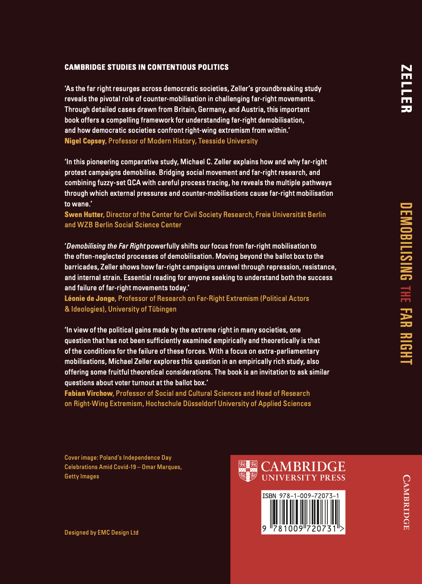

*planned publication with Cambridge University Press in September 2026*

:::: {.columns}
:::{.column width="35%"}

:::

:::{.column width="5%"}

:::

::: {.column width="60%"}

Social movement research has grown rapidly in recent decades. Yet the greatest share of research is tilted towards mobilisation and the tumult of movement activism. Less attention is paid to the downward slope of activity, to demobilisation. This book presents a comparative study of **[large far-right demonstration campaigns]{style="color:darkorange;"}** in **[Austria]{style="color:darkorange;"}, [England]{style="color:darkorange;"}**, and **[Germany]{style="color:darkorange;"}** over the last three decades (**[1990-2020]{style="color:darkorange;"}**). Demonstrations are a central tactic of many movements, particularly the far right. Studying the campaigns built around them not only helps to understand demobilisation, but also offers insights into a persistent threat to democratic societies. Using **[qualitative comparative analysis (QCA)]{style="color:darkorange;"}** to analyse dozens of cases, the book reveals diverse patterns of factors that cause far-right campaigns to demobilise and, going further, uses **[process-tracing techniques]{style="color:darkorange;"}** to identify mechanisms underlying these patterns. The book thereby deals with an urgent phenomenon, far-right activism, and contributes to an underdeveloped area of social movement theory.

:::
::::

*[Further information and resources will be available on this page following publication.]{style="color:darkred; font-size:18px;"}*
