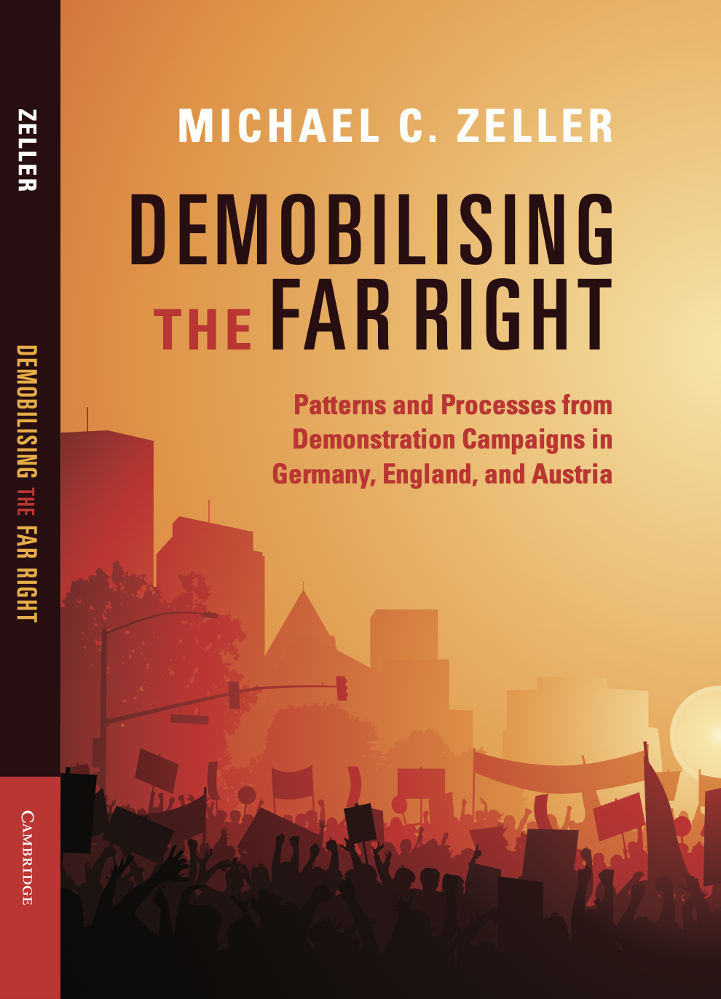

<!-- ::: {.grid} -->

<!-- ::: {.g-col-12 .g-col-sm-4} -->

<!-- ```{=html} -->
<!-- <div class="grid" style="--bs-columns: 5; row-gap: 0;"> -->
<!--   <div class="g-col-1 g-col-sm-0"></div> -->
<!--   <div class="g-col-3 g-col-sm-5"> -->
<!--     <picture> -->
<!--       <source media="(max-width: 576px)" srcset=""> -->
<!--       <source media="(min-width: 576px)" srcset=""> -->
<!--       }}" alt=""> -->
<!--     </picture> -->
<!--   </div> -->
<!--   <div class="g-col-1 g-col-sm-0"></div> -->
<!-- </div> -->
<!-- ``` -->

<!-- ::: -->

<!-- ::: {.g-col-12 .g-col-sm-8} -->


<!-- I'm a research associate in the [Faculty of Sociology](https://www.uni-bielefeld.de/fakultaeten/soziologie/) at [Universität Bielefeld](https://www.uni-bielefeld.de/). I earned a Ph.D. in political science from Central European University's [Doctoral School of Political Science, Public Policy and International Relations](https://dsps.ceu.edu/) in 2023. -->

I am an Assistant Professor in [comparative politics](https://www.gsi.uni-muenchen.de/lehreinheiten/ls_vp/team/mitarbeiter/index.html) at the [Geschwister-Scholl-Institut für Politikwissenschaft (GSI)](https://www.gsi.uni-muenchen.de/index.html) at [Ludwig-Maximilians-Universität München](https://www.lmu.de/de/index.html). I earned a Ph.D. in political science from Central European University's [Doctoral School of Political Science, Public Policy and International Relations](https://dsps.ceu.edu/) in 2023.

I study political violence and far-right socio-politics, as well as collaborating with colleagues on an array of topics within the area of comparative politics. My research applies a diverse array of methodological techniques, especially qualitative methods such as qualitative comparative analysis (QCA) and case study designs. I am a member of the Radicalisation Awareness Network Policy Support (RAN PS), the European Research Community on Radicalisation (ERCOR) Researchers’ Directory.

I teach courses that deal with applied research, including [Far-Right Socio-politics](https://michaelzeller.de/course-fr/), [Political Violence](https://michaelzeller.de/course-pv/), and [Social Movements](https://michaelzeller.de/course-sm/). I also teach graduate-level methodological courses, such as Comparative Political Research and Case-based Methods for Social Science.

<!-- I teach courses on [program evaluation and causal inference](https://evalf22.classes.andrewheiss.com/), [statistics and data science](https://statsf18.classes.andrewheiss.com/), [data visualization](https://datavizs22.classes.andrewheiss.com/), [economics](https://econs22.classes.andrewheiss.com/), and [science communication](https://storiesf17.classes.andrewheiss.com/). I'm also a [certified RStudio instructor](https://education.rstudio.com/trainers/people/heiss+andrew/) and a [Posit Academy mentor](https://posit.co/products/enterprise/academy/) and absolutely love teaching how to use [R](https://www.r-project.org/) and [the tidyverse](https://www.tidyverse.org/). -->

<!-- ::: -->

<!-- ::: -->

*******************************

__[*[Demobilising]{style="color:darkred;"} the [Far Right]{style="color:darkred;"}*]{style="font-size:30px;"}__   
(Cambridge University Press, 2026)

*scheduled publication in September 2026*



<!--  -->

Social movement research has grown rapidly in recent decades. Yet the greatest share of research is tilted towards mobilisation and the tumult of movement activism. Less attention is paid to the downward slope of activity, to demobilisation. This book presents a comparative study of **[large far-right demonstration campaigns]{style="color:darkorange;"}** in **[Austria]{style="color:darkorange;"}, [England]{style="color:darkorange;"}**, and **[Germany]{style="color:darkorange;"}** over the last three decades (**[1990-2020]{style="color:darkorange;"}**). Demonstrations are a central tactic of many movements, particularly the far right. Studying the campaigns built around them not only helps to understand demobilisation, but also offers insights into a persistent threat to democratic societies. Using **[qualitative comparative analysis (QCA)]{style="color:darkorange;"}** to analyse dozens of cases, the book reveals diverse patterns of factors that cause far-right campaigns to demobilise and, going further, uses **[process-tracing techniques]{style="color:darkorange;"}** to identify mechanisms underlying these patterns. The book thereby deals with an urgent phenomenon, far-right activism, and contributes to an underdeveloped area of social movement theory.

Further information and resources on the '[Book](https://michaelzeller.de/book/index_book.html)' page of this website

